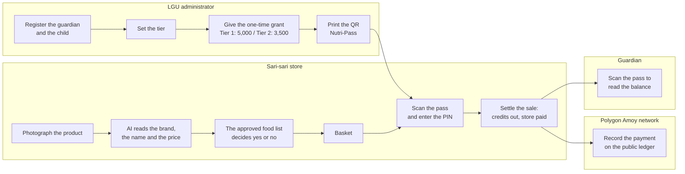

<div align="center">

  

</div>

<br />

## Team Information

**Team Name:**
JUMBO HOTDOG

**Project Name:**
BANTAYOG

---

## Project Brief

**The problem our solution addresses**  
One in four Filipino children under five suffers irreversible stunting caused by chronic malnutrition during their first 1,000 days of life. Government nutrition cash assistance is often diverted to non-nutritious items (like junk food or tobacco) due to a lack of traceability, while merchants face complex reimbursements that discourage program participation.

**our proposed solution**  
BANTAYOG transforms loose cash grants into targeted, tracked, nutrition-locked subsidies. Guardians are given a physical QR "Nutri-Pass" that acts as an offline digital wallet. Subsidies can only be spent on nutrient-dense foods at local sari-sari stores, validated via AI product recognition, and every transaction is securely settled and traced on the Polygon blockchain.

**The intended users or beneficiaries**

- Infants &amp; guardians in the First 1,000 Days cohort
- Low-income families relying on local credit
- LGUs (Local Government Units) administering the subsidies
- Local sari-sari store merchants

**The impact of our project**  
BANTAYOG gives LGUs full financial oversight over nutrition spending and ensures that every peso disbursed actively combats stunting. By working within existing community micro-economies (sari-sari stores) and locking funds to healthy food, we close the loop between government funding and measurable child nutrition outcomes.

---

## Team Members


| Name                   | Role                   |
| ---------------------- | ---------------------- |
| Bennett P. Payoyo      | Developer / Researcher |
| Alex L. Berin Jr.      | Developer / Researcher |
| Anjoe Mikael T. Albano | Developer / Researcher |
| Tyrone Loius V. Teemer | Developer / Researcher |


---

## Why This Problem Is Hard

The policy anchor is RA 11148 (*Kalusugan at Nutrisyon ng Mag-Nanay Act*), which protects the
first 1,000 days from conception. Stunting inside that window is irreversible. Cash assistance is
the standard delivery mechanism, and it fails in three specific ways:


| Failure mode          | What happens today                                                                                                         | What BANTAYOG does instead                                                                                |
| --------------------- | -------------------------------------------------------------------------------------------------------------------------- | --------------------------------------------------------------------------------------------------------- |
| **Diversion**         | Cash is fungible. Nothing stops it from becoming junk food, load, or tobacco.                                              | Credits buy approved food only. The approved food list makes the decision, not a promise.                 |
| **No audit trail**    | The LGU sees a disbursement list, never a receipt. Audit is manual, paper-based, and months late.                          | Every sale writes an item-by-item receipt at the moment of the sale.                                      |
| **Merchant friction** | Reimbursement is slow and bureaucratic, so sari-sari stores opt out — and they are the only shops many families can reach. | The store gets the credit the moment the sale completes, and moves the money out on demand. No paperwork. |


Two design constraints shaped everything else:

- **The guardian has no smartphone budget and can have low literacy.** The guardian interface is
therefore a printed piece of paper. There is no app to install and no account to remember.
- **Sari-sari stores have weak data connections.** The store app therefore installs on the phone, and each sale

    completes the moment the merchant confirms it.

---

## How BANTAYOG Works



### The five steps, in order

1. **Registration.** The administrator records the guardian and the child. The record holds the
 monthly income, the home location, and a 6-digit guardian PIN. The system keeps the PIN in a
 one-way protected form. Nobody can read the PIN again, not even an administrator.
2. **Tier.** The system puts each child in one of two tiers. Tier 1 is the critical tier. It
 applies while the age from conception is 1,000 days or less. This equals 730 days or less from
 birth. Tier 2 is the standard tier. It applies after that day. The system sets the tier again on
 each read, again at each scan, and one time each night. A child cannot stay in the critical tier
 after the child is too old for it.
3. **Grant.** Each child gets one grant only. Tier 1 gets 5,000 credits. Tier 2 gets 3,500
 credits. One credit is one peso. The tier gives the amount. No device and no user can ask for a
 different amount, and the system refuses a second grant for the same child.
4. **Purchase.** The merchant photographs the product. The AI reads the brand and the product
 name. It also gives a suitability result for a small child and a price estimate. The approved
 food list then makes the eligibility decision. The AI never makes that decision. The merchant
 scans the pass, and the guardian types the PIN. The system makes six checks in a fixed order:
 the pass signature, the pass validity, the status of the child, the PIN, a total above zero, and
 sufficient credits. After five wrong PIN entries the system locks the pass for 15 minutes.
5. **Settlement.** The system removes the credits from the pass, adds the same amount to the store
 balance, and writes the receipt. These three actions occur together, or none of them occurs. The
 merchant sees the result immediately. The payment goes to the public ledger after the sale, and
 the merchant moves the store balance to a wallet on demand.

### Safeguards we built on purpose


| Safeguard                        | How the system holds it                                                                                                                       |
| -------------------------------- | --------------------------------------------------------------------------------------------------------------------------------------------- |
| One path for money               | Every peso moves through one protected step in the database. That step locks the record, checks the balance, and writes the receipt together. |
| Exact money                      | Pesos keep two decimal places. Credits are whole numbers. One credit is one peso. No rounding error can occur.                                |
| A double tap cannot pay twice    | Each checkout carries one unique key. A repeated tap with the same key collides, and the system pays one time only.                           |
| One cash-out at a time           | The system takes a lock before it moves money out of a store balance. Two cash-outs cannot run together.                                      |
| The AI cannot approve a sale     | The approved food list is the only authority for eligibility. The AI only identifies the product.                                             |
| The device decides nothing       | The server sets the tier, the grant, the eligibility, and the balance. The app only shows the result.                                         |
| A negative balance is impossible | The database refuses a balance below zero, and it refuses any grant amount other than 5,000 or 3,500.                                         |


---

## Who Uses BANTAYOG

One system serves three groups. Each group sees its own screens only. A store device cannot open
the LGU portal, and the guardian page shows information only.


| User                   | What the user does                                                                                            | How the user signs in                             |
| ---------------------- | ------------------------------------------------------------------------------------------------------------- | ------------------------------------------------- |
| **LGU administrator**  | Registers a guardian and a child, sets the tier, releases the grant, and prints the Nutri-Pass                | Email and password, with an administrator role    |
| **Sari-sari merchant** | Scans a product, fills the basket, completes the checkout, reads the sales history, and moves the balance out | Mobile number and password, or a wallet signature |
| **Guardian**           | Reads the current balance and the recent purchases                                                            | No account. The printed pass is the key           |


---

## What Is Built

- **LGU portal.** Guardian and child registration, tier computation, the one-time grant, and
printed Nutri-Pass issue.
- **Store app.** AI product scan, branded and palengke baskets, guardian PIN with lockout,
checkout, and the sales history.
- **Merchant cash-out.** The merchant connects a wallet and moves the store balance out on demand.
- **Guardian balance page.** The current balance plus the 50 most recent purchases, read-only.
- **Public ledger record.** PHPC credits on the Polygon Amoy network, plus a nightly tier re-check.
- **Android mobile app of the store surface.** The merchant frontend installs on the phone as an
Android app.

---

## Tech Stack


| Layer                          | What we use                                                                                                                                    | Why it matters here                                                                                                                                                                          |
| ------------------------------ | ---------------------------------------------------------------------------------------------------------------------------------------------- | -------------------------------------------------------------------------------------------------------------------------------------------------------------------------------------------- |
| **AI at the counter**          | Google Gemini multimodal vision                                                                                                                | One photo returns the brand, the product name, a child-suitability verdict with flagged ingredients, a food group, and a peso price band. Gemini identifies; the approved food list decides. |
| **Store and portal UI**        | Next.js 16 (App Router), React 19, TypeScript 5.7, Tailwind CSS 4, Zustand 5, TanStack Query 5 and Table 8, react-hook-form                    | One codebase serves the LGU portal, the store counter, and the guardian balance page, each on its own sandboxed surface.                                                                     |
| **Merchant frontend delivery** | Capacitor 8 Android shell over the same web codebase                                                                                           | The merchant surface ships as an installable Android mobile app, built for low-end phones at the store counter.                                                                              |
| **Camera, QR and printing**    | Browser camera APIs, html5-qrcode and ZXing, react-qr-code, html-to-image                                                                      | Product photos and pass scans need no native plugin, and a Nutri-Pass prints straight from the browser.                                                                                      |
| **API and business rules**     | Hono 4 on Node, Zod 4 at every boundary, neverthrow result types, pino structured logs, XState lifecycle model                                 | Every request is parsed before it is trusted, and every expected failure is a typed value with a stable status code.                                                                         |
| **Data**                       | Supabase Postgres, pgvector image embeddings, pg_trgm fuzzy matching, append-only migrations, row-level security                               | The database itself holds the money rules: one guarded settlement step, a row lock, and constraints that make a bad row impossible.                                                          |
| **Abuse control**              | Upstash Redis sliding windows                                                                                                                  | Guardian PIN lockout and per-endpoint limits on login, scanning, and checkout.                                                                                                               |
| **Blockchain**                 | Polygon Amoy testnet (chain 80002), PHPC PHP-pegged ERC-20, upgradeable PHPCSubsidy (UUPS), Solidity 0.8.28, OpenZeppelin 5, Hardhat 3, viem 2 | A public settlement record for every peso, plus an upgrade path that keeps the storage layout intact.                                                                                        |
| **Cryptography**               | Argon2id guardian PINs, signed JWS pass tokens, AES-256-GCM key storage                                                                        | The paper pass is a real credential, and no secret is ever readable at rest.                                                                                                                 |
| **Monorepo and quality gate**  | pnpm 9 workspace, Turborepo 2, Vitest 2, fast-check property tests, DTO snapshot contracts                                                     | Lint with zero warnings, a full type-check, and the test suite gate every change.                                                                                                            |


---

## Getting Started

**Prerequisites:** Node ≥ 20, pnpm 9.15.0 (pinned — do not use npm or yarn), a Supabase project,
an Upstash Redis database, a Gemini API key, and a Polygon Amoy RPC URL with a zero-value testnet key.

```bash
# 1. install
pnpm install

# 2. environment — copy each example and fill it in
cp .env.example .env                          # Supabase, Upstash, Gemini, chain vars
cp apps/server/.env.example apps/server/.env
cp apps/web/.env.example apps/web/.env.local

# 3. database — apply supabase/migrations/*.sql in order to your project

# 4. contracts (optional; addresses go back into .env)
pnpm --filter @bantayog/contracts compile
pnpm deploy:contracts                         # Hardhat → Polygon Amoy

# 5. run — web on :3000, API on :3001
pnpm dev
```

Quality gate and per-package commands:

```bash
pnpm lint            # eslint, --max-warnings 0
pnpm type-check      # tsc --noEmit across the graph
pnpm test            # vitest in every package

pnpm --filter @bantayog/server test
pnpm --filter @bantayog/web test
pnpm --filter @bantayog/contracts test        # includes UUPS storage-layout tests
```

---

## Competitions &amp; Showcases

### SparkFest 2026 — 1st Runner-Up

BANTAYOG was built for **SparkFest 2026**, the flagship hackathon organized by the **Google
Developer Groups on Campus – Polytechnic University of the Philippines (GDG on Campus PUP)**. The
team placed **1st Runner-Up** on July 9, 2026.

---

## Repository Information

- **Live Demo:** [Watch Demo](https://drive.google.com/file/d/1HbexEd2dmRrOxbiT5l1bJY4QRoW5PWiQ/view?usp=drive_link)
- **APK Download:** [Download APK](https://drive.google.com/drive/folders/1WBwtM_48NqHBRsulMHh0qs_ClyvFr24N?usp=sharing)
- **Test Credentials (So you can login and test our project):** [Testing_Access](https://drive.google.com/file/d/1D7TcflxdrH6FG4aDZIQkJAVpAizVpaKg/view?usp=sharing) 

