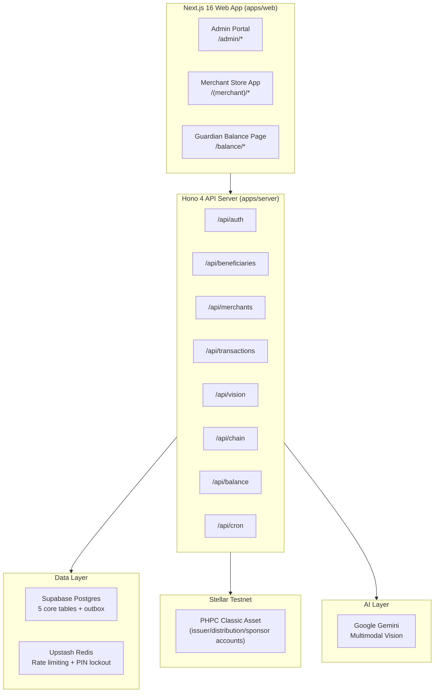
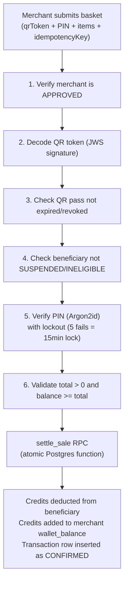
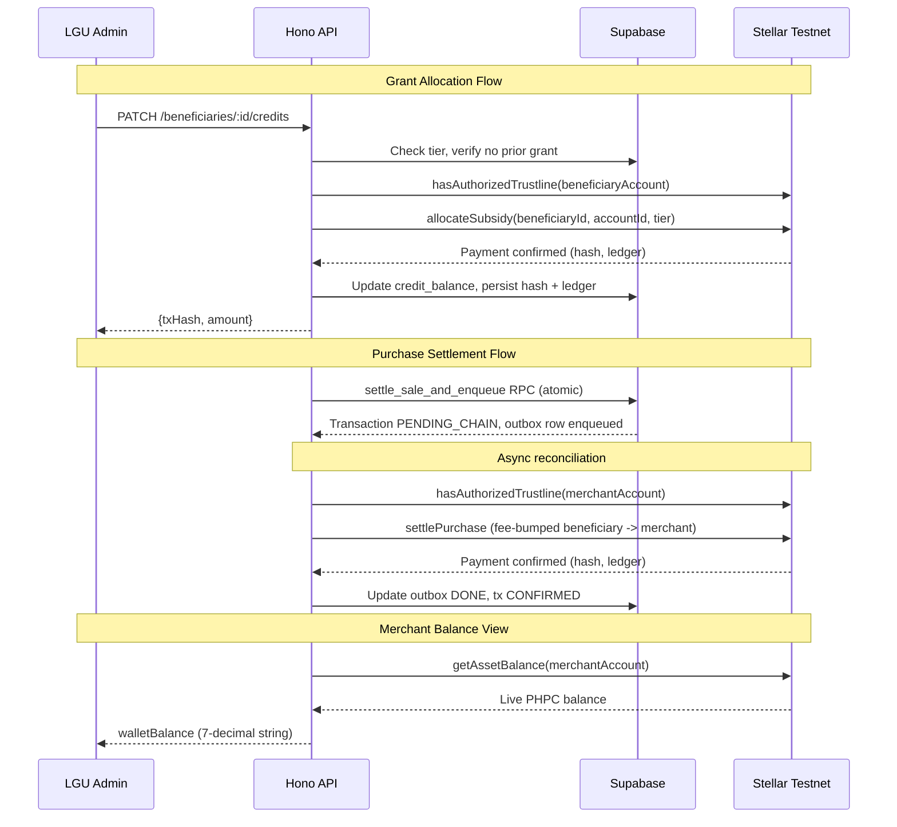

# BANTAYOG: Complete Codebase Overview

## Project Summary

BANTAYOG is a nutrition-locked subsidy system that turns government cash grants into targeted, traceable, nutrition-only credits for Filipino children in the First 1,000 Days window (RA 11148). It serves three user groups through one monorepo: LGU administrators, sari-sari store merchants, and guardians/beneficiaries.

---

## Architecture at a Glance

---

## Monorepo Structure

| Package | Path | Purpose |
|---|---|---|
| **@bantayog/web** | [apps/web](file:///home/home/bantayog/BANTAYOG/apps/web) | Next.js 16 frontend: Admin, Merchant, and Guardian surfaces |
| **@bantayog/server** | [apps/server](file:///home/home/bantayog/BANTAYOG/apps/server) | Hono 4 API: business logic, auth, vision, chain integration |
| **@bantayog/schema** | [packages/schema](file:///home/home/bantayog/BANTAYOG/packages/schema) | Shared Zod schemas for DTOs (auth, beneficiary, merchant, transaction) |
| **@bantayog/db** | [packages/db](file:///home/home/bantayog/BANTAYOG/packages/db) | Supabase client, repository layer, DB type definitions |

Toolchain: pnpm 9 workspaces, Turborepo 2, TypeScript 5.7, Vitest 2.

---

## 1. Admin (LGU) Processes

The LGU administrator is the program's authority. They register beneficiaries and merchants, control eligibility, allocate funds, and have full audit visibility.

### 1.1 Authentication

- **Route:** `POST /api/auth/login` ([auth.ts](file:///home/home/bantayog/BANTAYOG/apps/server/src/routes/auth.ts#L127-L158))
- **Flow:** Email + password via Supabase Auth. Server verifies `app_metadata.role === 'admin'`; non-admins are signed out and rejected with 403.
- **Frontend:** [/admin/login](file:///home/home/bantayog/BANTAYOG/apps/web/app/admin/login)

### 1.2 Beneficiary Registration

- **Route:** `POST /api/beneficiaries/register` ([beneficiaries.ts](file:///home/home/bantayog/BANTAYOG/apps/server/src/routes/beneficiaries.ts#L18-L62))
- **Service:** [BeneficiaryService.register()](file:///home/home/bantayog/BANTAYOG/apps/server/src/services/beneficiary.service.ts)
- **Frontend:** [/admin/beneficiaries](file:///home/home/bantayog/BANTAYOG/apps/web/app/admin/beneficiaries/page.tsx)

**Process:**
1. Admin fills in guardian name, mobile hash, child name, child age (months), monthly income, GPS coordinates, and a 6-digit PIN.
2. Input is validated against the shared Zod `CreateBeneficiaryDto` schema ([schema/src/beneficiary.ts](file:///home/home/bantayog/BANTAYOG/packages/schema/src/beneficiary.ts)).
3. The PIN is hashed with **Argon2id** (one-way; never readable again).
4. **Tier computation** runs via pure domain logic ([eligibility.ts](file:///home/home/bantayog/BANTAYOG/apps/server/src/domain/eligibility.ts)):
   - **Tier 1 (Critical):** Age from conception <= 1,000 days (birth age <= 730 days)
   - **Tier 2 (Standard):** Beyond that threshold
5. A beneficiary row is inserted into `beneficiaries` table with `eligibility_status = 'ELIGIBLE'`.
6. A signed **QR token** (JWS) is generated by [QrTokenService](file:///home/home/bantayog/BANTAYOG/apps/server/src/services/qr-token.service.ts) and stored in the `qr_passes` table.
7. A `card_serial` identifier is generated.
8. Response includes the QR token payload for printing the **Nutri-Pass** (a physical QR card).

### 1.3 One-Time Grant Allocation

- **Route:** `PATCH /api/beneficiaries/:id/credits` ([beneficiaries.ts](file:///home/home/bantayog/BANTAYOG/apps/server/src/routes/beneficiaries.ts#L94-L108))
- **Service:** `BeneficiaryService.allocateTierCredits()`

**Process:**
1. Admin triggers the grant for a registered beneficiary.
2. The server determines the amount from the beneficiary's current tier (not from the request body):
   - **Tier 1:** 5,000 PHPC credits
   - **Tier 2:** 3,500 PHPC credits
3. The system refuses a second grant for the same child.
4. An **on-chain allocation** is executed: `StellarClient.allocateSubsidy()` submits a native
   Stellar payment operation from the distribution account to the beneficiary's account, after a
   pre-check confirms the beneficiary account has an authorized PHPC trustline
   ([chain.client.ts](file:///home/home/bantayog/BANTAYOG/apps/server/src/services/chain.client.ts)).
5. The beneficiary's `credit_balance` in Postgres is updated.
6. The response includes the on-chain transaction hash.

### 1.4 Beneficiary Management

| Action | Route | What it does |
|---|---|---|
| List all | `GET /api/beneficiaries` | Paginated directory of all beneficiaries |
| Dashboard metrics | `GET /api/beneficiaries/metrics` | Total count, critical units, allocated PHPC, verified merchants |
| Change status | `PATCH /api/beneficiaries/:id/status` | PENDING / ELIGIBLE / INELIGIBLE / SUSPENDED. Requires admin password re-verification |

### 1.5 Merchant Registration and Approval

- **Register:** `POST /api/merchants/register` ([merchants.ts](file:///home/home/bantayog/BANTAYOG/apps/server/src/routes/merchants.ts#L24-L41))
- **Approve:** `PATCH /api/merchants/:id/approve`
- **Change Status:** `PATCH /api/merchants/:id/status` (requires admin password)
- **Frontend:** [/admin/merchants](file:///home/home/bantayog/BANTAYOG/apps/web/app/admin/merchants/page.tsx)

**Process:**
1. Admin enters store name, owner name, mobile number (E164), and a password.
2. A Supabase Auth user is created with a derived email (`{mobile}@merchant.bantayog.local`).
3. Merchant starts in `PENDING` status. Wallet address is deliberately set to `null` at registration.
4. Admin approves the merchant, changing status to `APPROVED`.
5. Status lifecycle: `PENDING` -> `APPROVED` -> `SUSPENDED` (and back) or `REJECTED`.

### 1.6 Transaction Visibility

- Admins can view all transactions across all merchants via `GET /api/transactions` with full filter support (by merchant, beneficiary, status, pagination).

### 1.7 Nightly Cron Jobs

| Job | File | Purpose |
|---|---|---|
| **Tier re-evaluation** | [cron/tier-reeval.ts](file:///home/home/bantayog/BANTAYOG/apps/server/src/cron/tier-reeval.ts) | Scans all ELIGIBLE beneficiaries. If a child has aged past 1,000 days from conception, transitions them to INELIGIBLE (Tier 2). |
| **On-chain reconciliation** | [cron/reconcile.ts](file:///home/home/bantayog/BANTAYOG/apps/server/src/cron/reconcile.ts) | Processes the `outbox` table: picks up PENDING `TRANSACTION_CHAIN_SUBMIT` events, submits fee-bumped beneficiary-to-merchant Stellar payments (with a merchant trustline pre-check), waits for confirmation, updates transaction status. Retries up to 3 times; on permanent failure, restores beneficiary balance. |

---

## 2. Merchant (Sari-Sari Store) Processes

The merchant surface is designed for low-end Android phones with weak data connections. It ships as an installable Android app via Capacitor 8 wrapping the same web codebase.

### 2.1 Authentication

Two login methods:

| Method | Route | Details |
|---|---|---|
| Mobile + password | `POST /api/auth/merchant-login` | Derives email from mobile E164; checks merchant status; rejects SUSPENDED |
| Token refresh | `POST /api/auth/merchant-refresh` | Refresh token exchange for session continuity |

- **Frontend:** [/(merchant)/merchant-login](file:///home/home/bantayog/BANTAYOG/apps/web/app/(merchant)/merchant-login)

### 2.2 Product Scanning (AI Vision)

- **Routes:** `POST /api/vision/classify`, `POST /api/vision/analyze-nutrition`, `POST /api/vision/analyze-scan` ([vision.ts](file:///home/home/bantayog/BANTAYOG/apps/server/src/routes/vision.ts))
- **Service:** [VisionService](file:///home/home/bantayog/BANTAYOG/apps/server/src/services/vision.service.ts) (12.5KB, the largest service file)

**Process:**
1. Merchant photographs a product using the device camera.
2. The image (base64, max ~15MB) is sent to the server.
3. **Google Gemini multimodal vision** identifies:
   - Brand name
   - Product name
   - Child-suitability verdict with flagged ingredients
   - Food group / category
   - Peso price estimate
4. The result is cross-referenced against the **products catalog** in Postgres (includes pgvector embeddings for fuzzy matching and pg_trgm for text similarity).
5. The **approved food list** (not the AI) makes the final eligibility decision.
6. For **non-branded palengke items**, a separate validation endpoint (`POST /api/vision/validate-non-branded`) accepts manual inputs plus a photo.

> [!IMPORTANT]
> The AI never approves a sale. It only identifies products. The eligibility decision is made by the catalog/approved food list.

### 2.3 Cart and Basket

- **Frontend:** [/(merchant)/cart](file:///home/home/bantayog/BANTAYOG/apps/web/app/(merchant)/cart)
  - Two flows: **branded** (AI scan) and **non-branded** (palengke/manual entry)
- **State:** Managed via Zustand stores ([stores/](file:///home/home/bantayog/BANTAYOG/apps/web/stores))

The merchant builds a basket of scanned/validated items, each with category, name, quantity, unit price, and credit cost.

### 2.4 Checkout (Transaction Settlement)

- **Route:** `POST /api/transactions` ([transactions.ts](file:///home/home/bantayog/BANTAYOG/apps/server/src/routes/transactions.ts#L53-L179))
- **Frontend:** [/(merchant)/checkout](file:///home/home/bantayog/BANTAYOG/apps/web/app/(merchant)/checkout)

**Process (6 sequential checks):**

**Atomic settlement via `settle_sale` Postgres RPC:**
- Locks the beneficiary row
- Checks balance >= amount (enforced by `CHECK (credit_balance >= 0)` constraint)
- Deducts from `beneficiaries.credit_balance`
- Adds to `merchants.wallet_balance`
- Inserts the transaction row
- All three happen in one database transaction, or none happen

**Safeguards built into the code:**

| Safeguard | Implementation |
|---|---|
| Double-tap prevention | `idempotency_key` (UUID) with UNIQUE constraint |
| PIN lockout | 5 failed attempts = 15-minute lock via Upstash Redis sliding window |
| Zero-amount rejection | Explicit check: `totalCreditDeducted <= 0` returns 400 |
| Over-balance rejection | `currentBalance < totalCreditDeducted` returns 400 |
| Negative balance impossible | DB constraint `CHECK (credit_balance >= 0)` |

### 2.5 Merchant Self-Profile and Balance

- **Route:** `GET /api/merchants/me` ([merchant-self.ts](file:///home/home/bantayog/BANTAYOG/apps/server/src/routes/merchant-self.ts))

**Process:**
1. Merchant receives a generated Stellar custodial account at registration/approval time (no
   wallet-connect step; merchants never manage a browser-extension wallet or sign a proof of
   ownership).
2. The route reads the merchant's live PHPC balance directly from Horizon
   (`StellarClient.getAssetBalance`) rather than from a custodial Postgres column, and returns it
   as a 7-decimal-safe decimal string.
3. Returns: id, storeName, ownerName, walletAddress, walletBalance (live on-chain), connected
   (boolean), status.
4. There is no cash-out endpoint: since merchants receive real PHPC per purchase (see 2.4), the
   balance the merchant sees is the balance they actually hold on-chain, not a custodial liability
   to withdraw.
- **Dashboard:** [/(merchant)/dashboard](file:///home/home/bantayog/BANTAYOG/apps/web/app/(merchant)/dashboard/page.tsx) with sales history

---

## 3. Beneficiary (Guardian) Processes

The guardian has **no app, no account, and no smartphone requirement**. The entire interface is a printed QR card and a read-only web page.

### 3.1 The Nutri-Pass (QR Card)

- A physical printed QR code containing a signed JWS token.
- Generated during registration and stored in `qr_passes` table.
- The token encodes the `beneficiaryId` and is cryptographically signed.
- The QR is the only credential the guardian needs.

### 3.2 Balance View

- **Route:** `GET /api/balance/view?token=<qrToken>` ([balance.ts](file:///home/home/bantayog/BANTAYOG/apps/server/src/routes/balance.ts#L37-L130))
- **Frontend:** [/balance](file:///home/home/bantayog/BANTAYOG/apps/web/app/balance/page.tsx)

**Process:**
1. Guardian (or anyone) scans the QR code with any phone camera.
2. The app opens the balance page with the token as a query parameter.
3. **Intentionally PUBLIC** (no auth middleware): access is authorized solely by the signed QR token.
4. Server verifies the JWS signature, checks expiry/revocation, resolves the beneficiary.
5. Returns: child name, current credit balance, and up to 50 most recent transactions (most-recent-first).
6. **Read-only**: no mutating controls in the response.

**Failure precedence (ordered):**
1. Invalid/expired QR token: deny all data, "invalid pass" message
2. Valid token but beneficiary not found: deny all data, "cannot be matched" message
3. Data retrieval failure: "temporarily unavailable" message

### 3.3 QR Verification During Checkout

- **Route:** `POST /api/auth/verify-qr` ([auth.ts](file:///home/home/bantayog/BANTAYOG/apps/server/src/routes/auth.ts#L285-L328))
- Called by the merchant app when scanning the guardian's QR at the counter.
- Verifies token, checks pass revocation/expiry, performs **live tier re-evaluation**, and returns beneficiary details + current tier.
- If SUSPENDED or INELIGIBLE, returns "invalid or expired".

---

## 4. Blockchain Technology Status

### 4.1 Network and Asset

| Property | Value |
|---|---|
| **Network** | Stellar Testnet |
| **Asset** | PHPC (Philippine Peso Coin), classic Stellar asset |
| **Peg** | 1 PHPC = 1 PHP |
| **Decimals** | 7 (Stellar native precision, stored as integer stroops) |
| **Issuer flags** | `AUTH_REQUIRED`, `AUTH_REVOCABLE`, `AUTH_CLAWBACK_ENABLED` |
| **Tooling** | `@stellar/stellar-sdk` 16 |

### 4.2 Accounts (issuer, distribution, sponsor)

There is no custom bookkeeping contract. PHPC is a classic Stellar asset; policy control comes
from issuer flags rather than contract code, and account balances/trustlines are the native
ledger's own accounting:

- **Issuer account.** Issues PHPC and sets the three issuer flags above (see
  `scripts/bootstrap-stellar.ts`).
- **Distribution account.** Holds the initial PHPC supply; the source of every tier allocation
  payment.
- **Sponsor account.** Covers transaction fees (via Stellar's fee-bump mechanism) and account
  reserves for beneficiaries and merchants, so neither ever needs to hold XLM.
- **Beneficiary and merchant accounts.** Custodial Stellar keypairs generated and encrypted at
  rest by `CustodialWalletService`, provisioned on-chain (sponsored account creation, PHPC
  trustline, issuer authorization) via `StellarClient.provisionAccount()`.

### 4.3 Backend Integration ([chain.client.ts](file:///home/home/bantayog/BANTAYOG/apps/server/src/services/chain.client.ts))

The `StellarClient` class wraps all on-chain interactions using `@stellar/stellar-sdk`, with
intent-shaped methods rather than raw operation calls:

| Method | What it does |
|---|---|
| `create(config)` | Builds a Horizon client, verifies connectivity by loading the distribution account |
| `getAssetBalance(accountId)` | Reads an account's live PHPC balance as exact bigint stroops |
| `hasAuthorizedTrustline(accountId)` | Checks whether an account can currently hold PHPC (pre-check before any payment) |
| `allocateSubsidy(beneficiaryId, accountId, tier)` | Pays the tier amount from distribution to a beneficiary account |
| `settlePurchase(input)` | Fee-bumped beneficiary-to-merchant payment for purchase settlement |
| `provisionAccount(accountId, accountSecret)` | Idempotent sponsored account creation, trustline, and authorization |
| `getLedgerSequence()` | Reads the latest Horizon ledger sequence (used for reconciliation) |

Every failure path returns a typed `Err(OnchainError)`. There is no mock fallback on failure.

### 4.4 On-Chain Data Flow

### 4.5 Current Blockchain Status

The blockchain layer targets Stellar testnet. Beneficiary and merchant accounts are custodial
Stellar keypairs, provisioned on-chain (account creation, trustline, authorization) at
registration/approval time. Allocation pays PHPC from the distribution account to the
beneficiary. Purchase settlement is a fee-bumped beneficiary-to-merchant payment, submitted
asynchronously through the transactional outbox after the merchant's counter-side result. The
merchant's balance view reads their live on-chain PHPC balance directly from Horizon rather than
from a custodial ledger column.

Soroban smart contracts (spending caps, tier-eligibility windows, expiring subsidies) are
roadmap work, not part of the current MVP; see `docs/adr/004-stellar-migration.md`'s "Phase 8"
section for what is planned there and why classic assets were chosen for the MVP.

---

## 5. Database Schema

### Core Tables (5 + 1 outbox)

| Table | Key Columns | Purpose |
|---|---|---|
| **beneficiaries** | id, guardian_name, child_name, child_age_months, pin_hash_argon2id, eligibility_status, credit_balance, card_serial, intervention_tier | Guardian-child pairs with subsidy balances |
| **merchants** | id, auth_user_id, store_name, owner_name, mobile_number_e164, wallet_address, wallet_balance, status, cashout_in_progress | Registered sari-sari stores |
| **transactions** | id, beneficiary_id, merchant_id, item_list_jsonb, total_credit_deducted, status, idempotency_key, onchain_tx_hash | Purchase records |
| **products** | id, name, category, eligibility_status, price_range_min/max | Nutritional product catalog with AI embeddings |
| **qr_passes** | id, beneficiary_id, token_payload, issued_at, expires_at, revoked | Signed QR tokens for Nutri-Passes |
| **outbox** | id, kind, payload_jsonb, status, attempts, last_error | Transactional outbox for async blockchain submission |

### Key Database Safeguards

- `CHECK (credit_balance >= 0)`: negative balances are impossible at the DB level.
- `settle_sale` RPC: atomic deduction + credit + insertion in a single DB transaction.
- `idempotency_key UNIQUE`: prevents double-tap payments.
- `cashout_in_progress` flag: prevents concurrent cash-outs.
- Row-Level Security (RLS) on all tables with role-based policies.

### Migrations (12 total)

| # | File | What it adds |
|---|---|---|
| 1 | [00001_init_core_tables.sql](file:///home/home/bantayog/BANTAYOG/supabase/migrations/00001_init_core_tables.sql) | 5 core tables, RLS, storage buckets |
| 2 | [00002_phase4_hardening.sql](file:///home/home/bantayog/BANTAYOG/supabase/migrations/00002_phase4_hardening.sql) | intervention_tier, blockchain fields, outbox table |
| 3 | 00003 | Historical EVM custodial-wallet migration (superseded by 00011 for Stellar) |
| 4 | 00004 | Custodial wallet support, `settle_sale` RPC |
| 5 | 00005 | Product reference images |
| 6 | 00006 | pgvector image embeddings |
| 7 | 00007 | match_product_embeddings RPC |
| 8 | 00008 | Product image URLs, general categories |
| 9 | 00009 | Nullable expires_at for QR passes |
| 10 | 00010 | Market prices table |
| 11 | 00011_stellar_custodial_accounts.sql | Stellar address CHECK constraints, `merchant_wallets` table |
| 12 | 00012_stellar_settlement.sql | Stroops/ledger-sequence columns, `settle_sale_and_enqueue` RPC |

---

## 6. Security Model

| Layer | Mechanism |
|---|---|
| **Authentication** | Supabase Auth (JWT), per-role verification (admin/merchant) |
| **Authorization** | RBAC middleware ([rbac.ts](file:///home/home/bantayog/BANTAYOG/apps/server/src/middleware/rbac.ts)): admin, merchant roles enforced per-route group |
| **Rate Limiting** | Upstash Redis sliding windows: global (100/min), login (5/min), PIN (3/min), Gemini (10/min) |
| **PIN Security** | Argon2id hashing, 5-attempt lockout with 15-min cooldown |
| **QR Token** | JWS (signed JWT), with DB-level expiry and revocation checks |
| **DB Security** | RLS on all tables, CHECK constraints, atomic RPCs |
| **Chain Security** | Issuer-enforced trustline authorization, encrypted custodial keys, trustline pre-checks before every payment |
| **Input Validation** | Zod 4 schemas at every API boundary |

---

## 7. API Route Map

| Route | Method | Auth | Role | Purpose |
|---|---|---|---|---|
| `/health` | GET | None | - | Liveness probe |
| `/api/auth/login` | POST | None | - | Admin login |
| `/api/auth/merchant-login` | POST | None | - | Merchant login (mobile+pw) |
| `/api/auth/merchant-refresh` | POST | None | - | Refresh merchant session |
| `/api/auth/verify-pin` | POST | None | - | PIN verification |
| `/api/auth/verify-qr` | POST | None | - | QR token + tier re-evaluation |
| `/api/auth/logout` | POST | JWT | admin, merchant | Sign out |
| `/api/balance/view` | GET | QR token | - | Guardian balance (public) |
| `/api/beneficiaries` | GET | JWT | admin | List beneficiaries |
| `/api/beneficiaries/register` | POST | JWT | admin | Register beneficiary |
| `/api/beneficiaries/metrics` | GET | JWT | admin | Dashboard metrics |
| `/api/beneficiaries/:id/credits` | PATCH | JWT | admin | Allocate tier-based grant |
| `/api/beneficiaries/:id/status` | PATCH | JWT | admin | Change eligibility status |
| `/api/merchants` | GET | JWT | admin | List merchants |
| `/api/merchants/register` | POST | JWT | admin | Register merchant |
| `/api/merchants/:id/approve` | PATCH | JWT | admin | Approve merchant |
| `/api/merchants/:id/status` | PATCH | JWT | admin | Change merchant status |
| `/api/merchants/me` | GET | JWT | merchant | Self-profile with live on-chain balance |
| `/api/vision/classify` | POST | JWT | merchant | AI product classification |
| `/api/vision/analyze-nutrition` | POST | JWT | merchant | AI nutrition analysis |
| `/api/vision/analyze-scan` | POST | JWT | merchant | Unified scan + catalog lookup |
| `/api/vision/validate-non-branded` | POST | JWT | merchant | Validate palengke item |
| `/api/products` | GET | JWT | admin, merchant | Product catalog |
| `/api/transactions` | GET/POST | JWT | admin, merchant | List/create transactions |
| `/api/transactions/:id` | GET | JWT | admin, merchant | Transaction detail |
| `/api/chain/balance` | GET | JWT | admin, merchant | On-chain PHPC balance (Horizon read) |
| `/api/cron/*` | POST | CRON_SECRET | - | Tier re-eval, reconciliation |

---

## 8. Frontend Surfaces

| Surface | Path | User | Key pages |
|---|---|---|---|
| **Admin Portal** | `/admin/*` | LGU admin | Login, beneficiary registry + registration, merchant management, dashboard metrics |
| **Merchant Store App** | `/(merchant)/*` | Sari-sari merchant | Login, dashboard + sales history, cart (branded/non-branded scan), checkout |
| **Guardian Balance** | `/balance` | Guardian | Read-only balance + transaction history (QR-authorized, no login) |
| **Offline Fallback** | `/~offline` | Any | Service worker offline page |

All three surfaces share one Next.js 16 codebase with sandboxed layouts. The merchant surface also ships as an Android APK via Capacitor 8.

---

## 9. Design System References

| Document | Path | Coverage |
|---|---|---|
| **Admin UI Design System** | `docs/ADMIN_UI_DESIGN_SYSTEM.md` | Complete design skill for the LGU Admin Portal: color tokens, typography, spacing, component anatomy, layout grid, animation classes, page composition rules. Also registered as an AI agent skill at `.agents/skills/bantayog-admin-ui/SKILL.md`. |
| **Security** | `docs/SECURITY.md` | Cryptographic and access-control design |
| **Smart Contract Ops** | `docs/SMART_CONTRACT_OPS.md` | Deployment, testing, and UUPS upgrade procedures |
