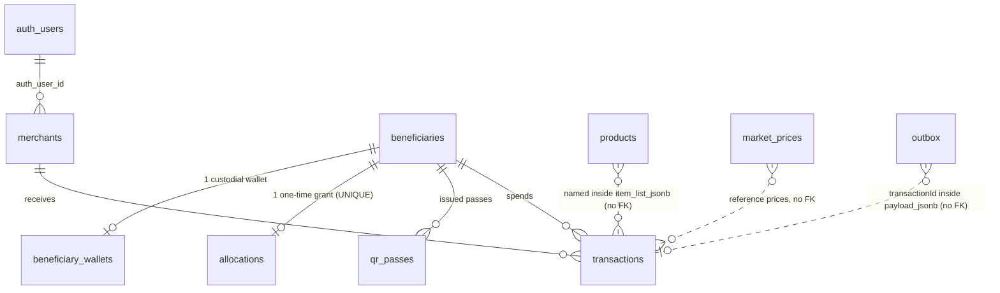

# SCHEMA — BANTAYOG database

Written in ASD-STE100 Simplified Technical English.

The schema is the sum of every file in `supabase/migrations/`. Migration 00001 alone is out of
date. This file records the current shape, the RLS policies, the RPCs and the verified drift
against `packages/db/src/types.ts`.

Rules that never change:

1. Migrations are append-only. Add the next numbered file. Never edit an applied file.
2. Mirror every schema change in `packages/db/src/types.ts` and `packages/db/src/types.test.ts` in
   the same change.
3. Money is `NUMERIC(12,2)`. Credits are integers. No float type holds money.
4. Money moves only through the `settle_sale` RPC.

## 1. Entity relationship diagram



`transactions.item_list_jsonb` holds the item names and prices as JSON. There is no foreign key
to `products`. The `outbox` row points at a transaction through its JSON payload only.

```
beneficiaries ──1:1── beneficiary_wallets      (PK = beneficiary_id)
beneficiaries ──1:0..1── allocations           (beneficiary_id UNIQUE)
beneficiaries ──1:N── qr_passes                (ON DELETE CASCADE)
beneficiaries ──1:N── transactions             (ON DELETE RESTRICT)
merchants     ──1:N── transactions             (ON DELETE RESTRICT)
auth.users    ──1:N── merchants                (ON DELETE CASCADE)
products, market_prices, outbox                (no foreign key)
```

## 2. Migration history

| File | Adds |
| --- | --- |
| `00001_init_core_tables.sql` | `beneficiaries`, `merchants`, `transactions`, `products`, `qr_passes`; `has_role()`; RLS on all five; buckets `cart-photos` and `qr-passes` |
| `00002_phase4_hardening.sql` | `beneficiaries.intervention_tier`; five credit and chain columns on `transactions`; the five-value status CHECK; `outbox` |
| `00003_polygon_amoy_migration.sql` | `beneficiary_wallets`, `allocations` |
| `00004_custodial_wallet.sql` | `merchants.wallet_balance`, nullable `wallet_address`, `cashout_in_progress`, the `settle_sale()` RPC |
| `00005_reference_images.sql` | `pgvector`; `products.reference_image_url` and `image_embedding vector(768)`; HNSW index; `match_product_embeddings()`; bucket `reference-images` |
| `00006_image_embeddings.sql` | Repeats the pgvector setup. See the warning below |
| `00007_match_product_embeddings_rpc.sql` | Recreates `match_product_embeddings()` with `category` in the result |
| `00008_product_image_url_and_general_categories.sql` | `products.image_url`; a data update that folds old category names into nine values |
| `00009_qr_passes_nullable_expires_at.sql` | `qr_passes.expires_at` becomes nullable |
| `00010_market_prices.sql` | `pg_trgm`; `market_prices` with trigram indexes |

### Warnings about re-running migrations

- `00006` runs `ALTER TABLE public.products ADD COLUMN image_embedding vector(768)` without
  `IF NOT EXISTS`. It fails if `00005` already ran. Treat `00006` as historical noise.
- `00005` runs `CREATE INDEX ON public.products USING hnsw (...)` with no name and no
  `IF NOT EXISTS`. A second run adds a duplicate index.
- `00010` uses `uuid_generate_v4()`. No migration enables `uuid-ossp`. The call works only because
  the hosted Supabase project already has that extension. Use `gen_random_uuid()` in a new table,
  as every other table does.

## 3. Tables

### beneficiaries

| Column | Type | Constraint |
| --- | --- | --- |
| `id` | UUID | PK, `gen_random_uuid()` |
| `guardian_name` | TEXT | NOT NULL |
| `guardian_mobile_hash` | TEXT | NOT NULL. Hashed, never plaintext |
| `child_name` | TEXT | NOT NULL |
| `child_age_months` | INTEGER | NOT NULL, 0 to 120 |
| `monthly_income_php` | NUMERIC(12,2) | NOT NULL, >= 0 |
| `gps_lat` | DOUBLE PRECISION | NOT NULL, −90 to 90 |
| `gps_lng` | DOUBLE PRECISION | NOT NULL, −180 to 180 |
| `pin_hash_argon2id` | TEXT | Nullable. Argon2id digest |
| `pin_salt` | TEXT | Nullable |
| `eligibility_status` | TEXT | NOT NULL, default `PENDING`. `PENDING`, `ELIGIBLE`, `INELIGIBLE`, `SUSPENDED` |
| `credit_balance` | NUMERIC(12,2) | NOT NULL, default 0, >= 0 |
| `card_serial` | TEXT | UNIQUE, nullable |
| `intervention_tier` | INTEGER | NOT NULL, default 1, IN (1, 2). Added in 00002 |
| `activated_at`, `deactivated_at` | TIMESTAMPTZ | Nullable |
| `created_at` | TIMESTAMPTZ | NOT NULL, `now()` |

Indexes: `card_serial`, `eligibility_status`.

The `credit_balance >= 0` CHECK is the last line of defence against an over-spend.

### merchants

| Column | Type | Constraint |
| --- | --- | --- |
| `id` | UUID | PK |
| `auth_user_id` | UUID | NOT NULL, references `auth.users(id)` ON DELETE CASCADE |
| `store_name`, `owner_name` | TEXT | NOT NULL |
| `mobile_number_e164` | TEXT | NOT NULL |
| `wallet_address` | TEXT | Nullable since 00004 |
| `wallet_balance` | NUMERIC(12,2) | NOT NULL, default 0, >= 0. Off-chain earnings |
| `cashout_in_progress` | BOOLEAN | NOT NULL, default false |
| `status` | TEXT | NOT NULL, default `PENDING`. `PENDING`, `APPROVED`, `REJECTED`, `SUSPENDED` |
| `created_at` | TIMESTAMPTZ | NOT NULL |

Indexes: `auth_user_id`, `wallet_address`, `status`.

`wallet_address` has no format CHECK. `beneficiary_wallets.address` does. The route validates the
`0x` plus 40 hex format before it writes.

### transactions

| Column | Type | Constraint |
| --- | --- | --- |
| `id` | UUID | PK. The checkout route sets it to the `idempotencyKey` |
| `beneficiary_id` | UUID | NOT NULL, ON DELETE RESTRICT |
| `merchant_id` | UUID | NOT NULL, ON DELETE RESTRICT |
| `item_list_jsonb` | JSONB | NOT NULL, default `[]`. The item-level audit record |
| `total_amount` | NUMERIC(12,2) | NOT NULL, default 0, >= 0 |
| `total_credit_deducted` | NUMERIC(12,2) | Default 0, >= 0 |
| `stablecoin_amount_wei` | TEXT | Nullable. A decimal string, not a number |
| `idempotency_key` | TEXT | UNIQUE, nullable |
| `onchain_tx_hash` | TEXT | Nullable |
| `status` | TEXT | NOT NULL, default `PENDING_CHAIN`. `PENDING_CHAIN`, `SUBMITTED`, `CONFIRMED`, `RECONCILED`, `FAILED` |
| `confirmed_at`, `created_at` | TIMESTAMPTZ | |

Indexes: `beneficiary_id`, `merchant_id`, `status`, `created_at DESC`.

Two facts about idempotency on the live path:

1. `settle_sale` writes `id`, `beneficiary_id`, `merchant_id`, `item_list_jsonb`, `total_amount`,
   `status` and `created_at` only. It does not write `idempotency_key`, `total_credit_deducted` or
   `stablecoin_amount_wei`.
2. The guard against a double spend is therefore the primary key. The route passes the
   `idempotencyKey` UUID as `p_transaction_id`. A retry hits a primary-key collision. Keep this
   behaviour if you change the RPC.

The checkout response is built in memory and reports `total_credit_deducted`, `idempotency_key`,
`confirmed_at` and `stablecoin_amount_wei`. The stored row does not hold those four values. Do not
read the API response as proof of the row contents.

`SUBMITTED` and `RECONCILED` pass the CHECK, but no code writes them.

### products

| Column | Type | Constraint |
| --- | --- | --- |
| `id` | UUID | PK |
| `name` | TEXT | NOT NULL |
| `category` | TEXT | NOT NULL. Free text, **no CHECK** |
| `eligibility_status` | TEXT | NOT NULL, `eligible` or `ineligible`, lowercase |
| `price_range_min` | NUMERIC(10,2) | NOT NULL, >= 0 |
| `price_range_max` | NUMERIC(10,2) | NOT NULL, >= `price_range_min` |
| `image_url` | TEXT | Nullable. The scan flow writes a base64 data URL here |
| `reference_image_url` | TEXT | Nullable |
| `image_embedding` | vector(768) | Nullable. HNSW index, cosine distance |
| `created_at` | TIMESTAMPTZ | NOT NULL |

Migration 00008 folded the old categories into nine values: `FRUITS`, `VEGETABLES`, `MEATS`,
`BEVERAGES`, `DAIRY`, `GRAINS`, `CANNED_GOODS`, `SNACKS`, `OTHER`. This is a convention only. The
column accepts any text, and the scan flow writes `Draft` when the category is unknown.

This table is the only authority for eligibility (ADR-003).

### qr_passes

| Column | Type | Constraint |
| --- | --- | --- |
| `id` | UUID | PK |
| `beneficiary_id` | UUID | NOT NULL, ON DELETE CASCADE |
| `token_payload` | TEXT | NOT NULL. The signed JWS |
| `issued_at` | TIMESTAMPTZ | NOT NULL, `now()` |
| `expires_at` | TIMESTAMPTZ | Nullable since 00009. NULL means the pass does not expire |
| `revoked` | BOOLEAN | NOT NULL, default false |

`revoked` is checked by `POST /api/auth/verify-qr` only. Checkout and the balance view read
`expires_at` only. A revoked pass can still transact. This is a known gap.

### beneficiary_wallets

| Column | Type | Constraint |
| --- | --- | --- |
| `beneficiary_id` | UUID | PK, so the relation is 1:1. ON DELETE CASCADE |
| `address` | TEXT | NOT NULL, UNIQUE, CHECK `^0x[0-9a-fA-F]{40}$` |
| `enc_ciphertext`, `enc_iv`, `enc_auth_tag` | TEXT | NOT NULL. AES-256-GCM parts |
| `created_at` | TIMESTAMPTZ | NOT NULL |

A private key never exists in plaintext at rest and never appears in a log.

### allocations

| Column | Type | Constraint |
| --- | --- | --- |
| `id` | UUID | PK |
| `beneficiary_id` | UUID | NOT NULL, **UNIQUE**, ON DELETE RESTRICT |
| `tier` | INTEGER | NOT NULL, IN (1, 2) |
| `amount_phpc` | NUMERIC(12,2) | NOT NULL, **IN (5000, 3500)** |
| `onchain_tx_hash` | TEXT | Nullable |
| `reconciled` | BOOLEAN | NOT NULL, default false |
| `allocated_at` | TIMESTAMPTZ | NOT NULL |

The UNIQUE constraint is the idempotency guard for the one-time grant. The `amount_phpc` CHECK
makes any other amount impossible at the database level.

### outbox

| Column | Type | Constraint |
| --- | --- | --- |
| `id` | UUID | PK |
| `kind` | TEXT | NOT NULL. In use: `TRANSACTION_CHAIN_SUBMIT`, `BALANCE_RESTORATION_AUDIT` |
| `payload_jsonb` | JSONB | NOT NULL, default `{}` |
| `status` | TEXT | NOT NULL, default `PENDING`. `PENDING`, `PROCESSING`, `DONE`, `FAILED` |
| `attempts` | INTEGER | NOT NULL, default 0 |
| `last_error` | TEXT | Nullable |
| `created_at`, `processed_at` | TIMESTAMPTZ | |

Index: `(status, created_at)`. There is no `run_after` column, so a retry has no backoff delay.

### market_prices

| Column | Type | Constraint |
| --- | --- | --- |
| `id` | UUID | PK, `uuid_generate_v4()` |
| `commodity_name` | TEXT | NOT NULL |
| `local_name`, `category` | TEXT | Nullable |
| `unit` | TEXT | NOT NULL |
| `price_min`, `price_max` | NUMERIC | NOT NULL. **No precision and no min/max CHECK** |
| `market_location` | TEXT | Default `National` |
| `source` | TEXT | NOT NULL |
| `as_of_date` | DATE | NOT NULL |
| `created_at`, `updated_at` | TIMESTAMPTZ | Default `now()` |

UNIQUE `(commodity_name, market_location, source, as_of_date)`. Two GIN trigram indexes support
the fuzzy match in `pricing-validation.service.ts`. The rows are seeded reference data, not a
live DA or PSA feed.

## 4. Functions and RPCs

### settle_sale — the only money path

```sql
settle_sale(p_beneficiary_id UUID, p_merchant_id UUID, p_amount NUMERIC(12,2),
            p_items JSONB, p_transaction_id UUID) RETURNS UUID
```

`SECURITY DEFINER`, `search_path = public`. One transaction does all of this:

1. Raise if `p_amount <= 0`.
2. `SELECT credit_balance ... FOR UPDATE` on the beneficiary row. Raise if the row is missing.
3. Raise if the credit is lower than the amount.
4. Subtract the amount from `beneficiaries.credit_balance`.
5. Add the amount to `merchants.wallet_balance`. Raise if the merchant is missing.
6. Insert the transaction row with status `CONFIRMED`.
7. Return the transaction id.

Any raise rolls back every step. The row lock makes two concurrent checkouts safe. Never
reproduce these steps in TypeScript.

### Other functions

| Function | Behaviour |
| --- | --- |
| `has_role(required_role TEXT)` | Reads `auth.users.raw_app_meta_data->>'role'`. `admin` satisfies every check. `SECURITY DEFINER`, STABLE |
| `match_product_embeddings(query_embedding vector(768), match_threshold float, match_count int)` | Cosine kNN over `products.image_embedding`. Returns id, name, category, eligibility_status, price range, reference image and similarity. 00007 is the current version |

## 5. RLS policies

RLS is enabled on every application table. The API server uses the service role key and therefore
bypasses RLS. Route guards and explicit ownership checks are the real gate. Keep both correct.

| Table | Policies |
| --- | --- |
| `beneficiaries` | `admin_all_beneficiaries` |
| `merchants` | `admin_all_merchants`, `self_read_merchants`, `self_update_merchants` (`auth_user_id = auth.uid()`) |
| `transactions` | `admin_all_transactions`, `merchant_read_own_transactions`, `merchant_insert_own_transactions` (merchant id maps to `auth.uid()`) |
| `products` | `admin_all_products`, `authenticated_read_products` |
| `qr_passes` | `admin_all_qr_passes` |
| `outbox` | `admin_all_outbox` |
| `beneficiary_wallets` | `admin_all_beneficiary_wallets` |
| `allocations` | `admin_all_allocations` |
| `market_prices` | `Allow authenticated read access to market_prices` |

There is no policy that lets a merchant `UPDATE` a transaction, and no policy that lets any client
read `beneficiary_wallets`. The public balance view works because the server holds the service
role key, not because a policy allows it.

### Storage buckets

| Bucket | Private | Limit | Types | Policies |
| --- | --- | --- | --- | --- |
| `cart-photos` | yes | 50 MB | jpeg, png, webp | authenticated insert and select |
| `qr-passes` | yes | 10 MB | png, svg+xml | authenticated insert and select |
| `reference-images` | yes | 50 MB | jpeg, png, webp | admin insert, update and delete; authenticated select |

## 6. Verified drift: SQL against `packages/db/src/types.ts`

Do not trust `types.ts` alone. Read the migrations.

| Item | SQL | `types.ts` |
| --- | --- | --- |
| `beneficiaries.intervention_tier` | exists (00002) | missing from `BeneficiaryRow` |
| `transactions.total_amount` | exists (00001) | missing from `TransactionRow` |
| `TransactionStatus` | `PENDING_CHAIN, SUBMITTED, CONFIRMED, RECONCILED, FAILED` | adds `DB_RECORDED` and `BROADCAST`, both rejected by the CHECK; omits `SUBMITTED` |
| `transactions.idempotency_key` | nullable | typed as `string` |
| `transactions.stablecoin_amount_wei` | nullable | typed as `string` |
| `qr_passes.expires_at` | nullable (00009) | typed as `string` |
| `products.reference_image_url`, `image_embedding` | exist (00005) | missing from `ProductRow` |
| `outbox.last_error` | exists (00002) | missing |
| `outbox.run_after` | no migration creates it | present in `OutboxRow` |
| `administrators` table | no migration creates it | fully typed |
| `photo_receipts` table | no migration creates it | fully typed |
| `claim_outbox_rows()` | no migration creates it | typed under `Functions` |
| `market_prices` table | exists (00010) | not typed at all |

Consequences:

1. Never write `DB_RECORDED` or `BROADCAST` to `transactions.status`.
2. A read of `intervention_tier`, `total_amount` or `last_error` needs a cast today.
3. Check that `administrators`, `photo_receipts` and `claim_outbox_rows` exist in the target
   database before you use them. The reconcile cron does a plain `PENDING` to `PROCESSING` update
   instead of `claim_outbox_rows`.
4. Reconciling `types.ts` with the migrations is a useful, self-contained task. Do it as one
   change, with `packages/db/src/types.test.ts` updated in the same commit.

## 7. Checklist for a schema change

1. Add the next numbered file in `supabase/migrations/`. Use `IF NOT EXISTS`. Name every index.
2. Use `gen_random_uuid()` for a new primary key.
3. Add a CHECK for every closed value set and every non-negative amount.
4. Update `packages/db/src/types.ts` and `packages/db/src/types.test.ts`.
5. Update this file: the table section, the RLS section and, if needed, the drift table.
6. Update `dto/mappers.ts` and the DTO snapshot if the change reaches the API.
7. Run `pnpm --filter @bantayog/db test` and `pnpm --filter @bantayog/server test`.
8. Ask for confirmation before you apply the migration to a real Supabase project.
