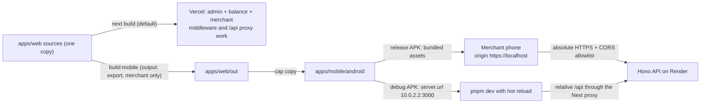

# HANDOFF — Merchant Android APK (Capacitor + Next static export)

Written in ASD-STE100 Simplified Technical English.

**Audience:** the implementing agent (GPT-5.6 Terra Low, with execution tools).
**Author:** planning session, 2026-07-28.
**Status:** plan approved by the repository owner. No code is written yet.
**Deadline context:** the WOCEE 2026 live showcase is August 8, 2026. See `docs/SHOWCASE.md`.

---

## 1. Objective

Make the merchant surface of `apps/web` into an Android APK. The web code must be inside the
APK. The app must open without a network connection. The APK must contain the merchant routes
only. The admin portal and the public balance view must stay out of the APK.

The developer must not rebuild the APK for each code change during development. A live-reload
loop must exist for the Android emulator first, and for a physical phone later.

---

## 2. How you must work

1. Read these files before you start: `AGENTS.md`, `docs/context/RULES.md`,
   `docs/context/ARCHITECTURE.md`, `.kiro/steering/structure.md`, `.kiro/steering/tech.md`,
   `.kiro/steering/frontend.md`.
2. Obey Rule 0 in `docs/context/RULES.md`. The conventions in the repository win over any
   suggestion in this file.
3. Do one task at a time. Complete the acceptance check of a task before you start the next task.
4. Work test-first. Read section 6 before Task 1. Use the TDD skill from the `superpowers` plugin
   if the plugin gives one; if not, use the red-green-refactor loop in section 6.1.
5. Run this gate before you present each task: `pnpm lint` (0 warnings), `pnpm type-check`, and
   the package test script. `pnpm lint` uses `--max-warnings 0`.
6. Add a test for each new pure function. Put the test beside the code as `<name>.test.ts`.
7. Do not commit. Do not push. The owner asks for a commit when the owner wants one.
8. Ask the owner before you: change auth, RBAC or RLS; change `settle_sale` or the cash-out lock;
   apply a migration; deploy; add a new dependency; or spend from `DEPLOYER_PRIVATE_KEY`. This work
   needs only the dependency permission (Capacitor, and Playwright in Task 11).
9. Tell the owner what you could not verify. Do not write a claim that you did not test.
10. This work adds no database migration and no schema change.

### Constraints that you must not break

- Do not put business logic in `apps/web`. The tier, the eligibility, the balance and the
  settlement stay in `apps/server`.
- Do not add logic to `apps/web/app/api/[...proxy]/route.ts`.
- Do not reintroduce `Stellar`, `Freighter`, `Freighter`, `SDF` or chain id `Testnet`. The test
  `apps/server/src/static-checks/forbidden-references.test.ts` fails the build if you do.
- Do not add a mutating endpoint under `/api/balance`.
- Do not commit a keystore, an APK, an AAB or an `.env` file. The `.gitignore` file already
  ignores `*.jks`, `*.keystore`, `*.apk`, `*.aab` and `.env*`.
- Do not print a secret, a PIN, a private key or a token in a log or an error message.

---

## 3. Project context (short)

BANTAYOG changes an LGU nutrition cash grant into a nutrition-locked subsidy. A guardian gets a
printed QR "Nutri-Pass". A merchant spends the credits on child-appropriate food only. The
system settles each sale off-chain first, then records it on Stellar Testnet testnet.

The repository is a pnpm workspace with Turborepo:

| Path | Role |
| --- | --- |
| `apps/web` | Next.js 16 PWA. Three surfaces in one deployment: admin, merchant, balance. View layer only |
| `apps/server` | Hono 4 API on Render. All business logic |
| `packages/{schema,db,contracts,config}` | Shared Zod schemas, Supabase types, Solidity, tooling config |

`apps/web/middleware.ts` separates the three surfaces by hostname. `apps/web/app/api/[...proxy]/route.ts`
forwards `/api/*` to the API server.

---

## 4. Verified facts

I verified each line below in this session. The date is 2026-07-28.

### 4.1 Local machine

| Item | Value | How I verified |
| --- | --- | --- |
| Node | v26.4.0 | `node -v` |
| pnpm | 9.15.0 | `pnpm -v` |
| System JDK | openjdk 26.0.2 (2026-07-21) | `java -version` |
| Android Studio | `/opt/android-studio` | directory listing |
| Android Studio JBR | openjdk 21.0.10 | `/opt/android-studio/jbr/bin/java -version` |
| Android SDK | `/home/yahiro/Android/Sdk` | directory listing |
| SDK platform | `android-36.1` only | `ls $SDK/platforms` |
| SDK build-tools | `36.0.0` | `ls $SDK/build-tools` |
| SDK subfolders present | `build-tools`, `emulator`, `licenses`, `platforms`, `platform-tools`, `sources` | `ls $SDK` |
| `cmdline-tools` | **absent** | same listing |
| `system-images` | **absent** | same listing |
| AVD | **none exists** | `ls ~/.android/avd` is empty |
| `ANDROID_HOME` | **not set** | `echo $ANDROID_HOME` |
| `ANDROID_SDK_ROOT` | **not set** | `echo $ANDROID_SDK_ROOT` |

Consequences:
- You must create an AVD. Use the Android Studio Device Manager, because `cmdline-tools` and
  `system-images` are absent. The Device Manager downloads the system image.
- You must set `ANDROID_HOME=/home/yahiro/Android/Sdk` for the Capacitor CLI and for Gradle, or
  write `sdk.dir` into `apps/mobile/android/local.properties`.
- You must not build with the system JDK 26. Use the Android Studio JBR 21 at
  `/opt/android-studio/jbr`. The Gradle compatibility matrix accepts JVM 17 to 26, but the
  Android Gradle Plugin and the Kotlin toolchain are validated on JDK 17 and 21, and Capacitor 8
  documents JDK 21.

### 4.2 Published package versions

| Package | Version | Note |
| --- | --- | --- |
| `@capacitor/core` | 8.4.2 | `npm view` |
| `@capacitor/cli` | 8.4.2 | `engines.node` is `>=22.0.0`. Node 26.4.0 satisfies it |
| `@capacitor/android` | 8.4.2 | |
| `@capacitor/browser` | 8.0.4 | needed for the wallet handoff fallback |
| `next` (installed) | 16.2.10 | from `node_modules/.pnpm` |
| `hono` (installed) | 4.12.27 | from `node_modules/.pnpm` |

Capacitor 8 targets Android SDK 36 and minSdk 24. The installed platform is `android-36.1`. If
Gradle asks for a platform that is absent, install it with the Android Studio SDK Manager.

### 4.3 Library behaviour

| Fact | Evidence |
| --- | --- |
| Hono `cors()` accepts `origin?: string \| string[] \| ((origin, c) => ...)` | type declaration in `hono@4.12.27/dist/types/middleware/cors/index.d.ts` |
| Next 16.2.10 supports `allowedDevOrigins` | symbol found in `next/dist/server/config-shared.d.ts` |
| Capacitor config has `server.appStartPath?: string` | `@capacitor/cli@8.4.2/dist/declarations.d.ts` line 617 |
| Capacitor resolves `webDir` with `path.resolve(appRootDir, webDir)` | `@capacitor/cli@8.4.2/dist/config.js`. A path such as `../web/out` is therefore valid |
| Capacitor Android origin is `https://localhost` | `server.androidScheme` default is `https`, `server.hostname` default is `localhost` (Capacitor config docs) |
| `MediaDevices.getUserMedia` keeps working in the Capacitor WebView | the Capacitor config docs state that `server.hostname: localhost` preserves the secure context that `getUserMedia` and `navigator.geolocation` need |
| `server.url` and `server.cleartext` are for live reload only | Capacitor config docs mark both "not intended for use in production" |
| Next static export does not support Proxy (middleware), Route Handlers that read the Request, redirects, rewrites, headers, ISR, Server Actions, the default image loader, or dynamic routes without `generateStaticParams` | Next 16 documentation page "Static Exports", updated 2026-07-22 |

### 4.4 Repository facts

| Fact | Location |
| --- | --- |
| Every merchant page is a client component | `"use client"` on all 8 files under `apps/web/app/(merchant)/` |
| Merchant API calls use relative `/api/*` | `cart/branded/page.tsx` (2), `cart/non-branded/page.tsx` (1), `checkout/page.tsx` (1), `merchant-login/page.tsx` (1 plain `fetch`), `components/merchant/recent-transactions.tsx` (1), `components/merchant/transfer-modal.tsx` (1), `components/merchant/wallet-balance-card.tsx` (1), `hooks/use-merchant-profile.ts` (1), `lib/api.ts` `refreshMerchantToken` (1) |
| `middleware.ts` 404s merchant routes for a non-localhost host | `apps/web/middleware.ts`. `isLocalhost` matches `localhost`, `127.0.0.1` and `0.0.0.0` only. The emulator host alias `10.0.2.2` falls into the admin branch, which 404s `/merchant-login`, `/dashboard`, `/cart` and `/checkout` |
| The wallet adapter picks a wrong API base inside the APK | `apps/web/lib/chain/wallet-adapter.ts`: `window.location.origin.includes("localhost") ? "http://localhost:3001" : ""`. The Capacitor origin `https://localhost` matches, so the app calls the phone itself |
| The merchant cash-out needs an injected EIP-1193 provider | `apps/web/lib/chain/wallet-adapter.ts` reads `window.ethereum`. A Capacitor WebView has no injected provider |
| `useSearchParams` is already inside `<Suspense>` | `cart/branded`, `cart/non-branded`, `checkout/complete`, `balance` |
| `localStorage` access is guarded or inside an effect | `lib/api.ts`, `stores/pin-store.ts`, `providers/pin-lock-provider.tsx`, `app/(merchant)/layout.tsx`, `hooks/use-merchant-profile.ts` |
| The cart store uses `sessionStorage` through `createJSONStorage(() => sessionStorage)` | `stores/cart-store.ts`. `zustand` catches the failure during a server render. The current `next build` already prerenders these pages |
| No merchant page uses `next/image` | only `app/(auth)/login/page.tsx` and `components/admin/header-nav.tsx` use it |
| Node-only modules stay out of the merchant surface | `@node-rs/argon2` and `lib/env.ts` are imported by `lib/services/*` and `lib/middleware/auth.ts` only. No merchant page or merchant component imports them |
| The camera code uses plain web APIs | `hooks/use-camera-preview.ts` calls `navigator.mediaDevices.getUserMedia`. QR decoding uses `html5-qrcode` and `@zxing/browser` |
| An old TWA identity exists | `apps/web/public/.well-known/assetlinks.json` declares package `app.vercel.merchant_bantayog.twa` with a SHA-256 fingerprint. The APK in the README was built outside this repository |
| The PWA manifest already starts at the merchant login | `apps/web/public/manifest.json`, `start_url: /merchant-login` |
| The server CORS reads a comma-separated allowlist | `apps/server/src/app.ts`, commit `48d4d74`. That commit is on `origin/main`, so the Render deployment already runs it. Task 3 is complete and live |
| The deployed API is on Render | `https://bantayog.onrender.com`. Verified 2026-07-29: a preflight from `Origin: https://localhost` returns `access-control-allow-origin: https://localhost`, and `https://bantayog-web.vercel.app` is allowed too. The Render value is `CORS_ORIGIN=https://localhost,https://bantayog-web.vercel.app` |
| The Render free plan sleeps | Verified 2026-07-29: the first `/health` call after idle did not answer inside 25 s, and the next call answered in 0.18 s. In the APK a cold start looks exactly like a network failure |
| The Railway host is retired | `https://bantayogserver-production.up.railway.app` still answers, but its `CORS_ORIGIN` holds no `https://localhost`. Two files hardcoded it and are now corrected: `apps/web/app/api/[...proxy]/route.ts` line 5 and `apps/web/.env.local` |
| A rejected preflight and a dead network look the same | A blocked CORS response makes `fetch` reject with a `TypeError` and no status. The merchant login shows "Unable to connect. Please check your network and try again." for both causes. Task 8 must separate the two messages |
| `turbo.json` lists every environment variable | `globalEnv` already contains `NEXT_PUBLIC_API_BASE_URL` and `CORS_ORIGIN`. It does not contain `NEXT_PUBLIC_MOBILE` or `CAP_SERVER_URL` |

---

## 5. Design decision

Keep one copy of the merchant code in `apps/web`. Add a second build mode that makes a
merchant-only static export. Add a thin Capacitor Android project that bundles the export.



The mobile build hides six paths, then runs `next build`, then restores the six paths:

```
middleware.ts     app/api     app/admin     app/balance     app/(auth)     app/page.tsx
```

Directory-level exclusion keeps the list stable. A new admin route goes inside `app/admin`, so
the mobile build excludes it automatically. A new merchant route goes inside `app/(merchant)`, so
the mobile build includes it automatically.

`app/page.tsx` calls the server function `redirect()`, which a static export cannot represent.
The mobile build therefore hides the root page and Capacitor starts at `/merchant-login` through
`server.appStartPath`.

### Options that the owner and I rejected

| Option | Reason for rejection |
| --- | --- |
| React Native | A full rewrite of the merchant UI, the camera, the QR scan and the stores. `apps/web` must keep the admin and balance surfaces anyway |
| A refreshed TWA with Bubblewrap | The assets stay on the network, and the app needs Chrome. The owner asked for bundled code |
| Capacitor with `server.url` at the deployed site | No offline start. The owner asked for bundled code |
| A separate `apps/merchant` Next app that imports shared code | It needs a refactor of the `@/` aliases and the shared primitives. The showcase is on August 8, 2026. The static export configuration moves to that structure later without a change |

---

## 6. Test strategy and TDD workflow

Test discipline is a requirement of this work, not an option. Read this section before Task 1.

### 6.1 The TDD loop (mandatory)

The Codex `superpowers` plugin is installed on the owner machine. If the plugin gives a
test-driven-development skill or workflow, use it. I could not inspect the plugin interface from
the planning session, so confirm the interface yourself before you rely on it. If the skill is not
available, follow this loop by hand:

1. **Red.** Write one failing test for one behaviour. Run it. Confirm that it fails for the
   correct reason. A test that passes on the first run proves nothing.
2. **Green.** Write the smallest amount of code that makes the test pass.
3. **Refactor.** Improve the shape. Keep the test green. Do not add behaviour here.
4. **Gate.** Run `pnpm lint`, `pnpm type-check` and the package test script.
5. Repeat. One behaviour per cycle.

Write the test first for every pure function, every URL builder, every predicate and every
verifier in this work. Three categories are exempt, because a unit test for them has no value:
the native project files that `cap add android` generates, configuration files, and documents. The
acceptance check of the task is the proof for those three.

### 6.2 What the repository already gives you (verified)

| Item | Fact |
| --- | --- |
| Runner | Vitest 2 in every package. `environment: node`, `globals: true` |
| Location | The test sits beside the code as `<name>.test.ts`. There is no separate test tree |
| Web include | `apps/web/vitest.config.ts` includes `lib/**/*.test.ts` and `app/api/**/*.test.ts` **only**. A component test does not run. Put testable logic in `apps/web/lib/**` |
| Web aliases | `@`, `@bantayog/schema` and `@bantayog/db` are declared in `vitest.config.ts` and in `tsconfig.json`. Update both files if you add an alias |
| Web coverage | `coverage.include` is `lib/**/*.ts`, and it excludes `lib/env.ts` |
| Server tests | `src/app.test.ts` (routes and 404), `src/e2e/transaction-flow.test.ts` (scan to settle, with a mocked chain client), `src/static-checks/forbidden-references.test.ts` |
| Server contracts | DTO snapshots in `src/dto/__snapshots__/mappers.test.ts.snap`. Update a snapshot on purpose only |
| Property tests | `fast-check` 4.8.0 is a dev dependency of `apps/server` |
| Browser and device E2E | **None exists.** `@playwright/test` is in `pnpm-lock.yaml` only as an optional peer of Next 16, and it is not installed |

Rules that stay true for every new test: inject time and randomness, use no live network, use no
shared mutable fixture, and depend on no test order. Never call Gemini or the deployed API from a unit test
or an integration test.

### 6.3 The six test levels for this work

| Level | Question it answers | Tool | Where | Task |
| --- | --- | --- | --- | --- |
| Unit | Does one pure function hold its contract? | Vitest | `apps/web/lib/**`, `apps/server/src/**` | 1, 2, 3, 5, 7 |
| Build | Is the artifact correct? | Vitest plus a script | `apps/web/lib/build/`, `apps/web/scripts/` | 1 |
| Integration | Do two parts meet correctly? | Vitest with `app.request()` and an injected `fetch` | `apps/server/src/app.test.ts`, `apps/web/lib/api.test.ts` | 2, 3 |
| Regression | Does a known defect stay fixed? | Vitest | beside each fix | 1, 2, 5, 7 |
| E2E | Does the merchant flow work from end to end? | Playwright (browser) and the device | `apps/web/e2e/`, the phone | 11 |
| Smoke | Is this build alive? | `adb` script plus a manual checklist | `apps/mobile/scripts/` | 6, 9, 11 |

**Unit.** The new pure functions are `planHiddenPaths` (Task 1), `verifyExportListing` (Task 1),
`apiUrl` (Task 2), `isDevHost` (Task 5), `toNutritionCategory` (Task 6A), `resolveWalletStrategy` (Task 7) and
`buildVerificationMessage` (Task 7). Each one gets a test file beside it, written before the
implementation. Cover the boundaries: empty input, a trailing slash, an unknown path, and the
production case.

**Build.** A build that emits the wrong files must fail the command, not a reviewer. Keep the
decision in a pure function that takes a list of relative paths and returns the failures. The
script gathers the real listing of `out/` and gives it to the function. `build:mobile` exits
non-zero on any failure. Assert at least: `merchant-login/index.html` exists; no path starts with
`admin/`, `balance/` or `login/`; `_next/` exists; the listing holds no `api/` route file.

**Integration.** Two seams matter. On the server, drive the real Hono app with `app.request()`
and assert the CORS headers for an allowed origin, for an unknown origin, and for the `OPTIONS`
preflight that an `Authorization` header triggers. On the web, call `authFetch` with an injected
`fetch` double and assert the absolute URL in mobile mode, the `Authorization` header, and the
refresh path when the stored token is expired.

**Regression.** Planning found five real defects. Each one needs a named test in the same file as
the fix. Do not close a task while its regression test is absent.

| ID | Defect | Test to write |
| --- | --- | --- |
| R1 | `middleware.ts` 404s every merchant route when the host is the emulator alias `10.0.2.2` | `isDevHost("10.0.2.2", "development")` is true. `isDevHost("10.0.2.2", "production")` is false |
| R2 | A static export has no `/api` proxy, so a relative path cannot reach the API | `apiUrl("/api/transactions")` returns the absolute URL in mobile mode, and `/api/transactions` on the web |
| R3 | A base URL that ends with `/` makes a double slash | `apiUrl` returns exactly one slash between the base and the path |
| R4 | `wallet-adapter.ts` calls `http://localhost:3001` inside the APK, because the Capacitor origin `https://localhost` contains the text "localhost" | The wallet verification URL is absolute in mobile mode and holds no `localhost:3001` |
| R5 | An APK for merchants must not carry the LGU portal | `verifyExportListing` fails on a listing that holds `admin/` or `balance/`, and fails when `merchant-login/index.html` is absent |
| R6 | A module-scope import of `@Freighter/sdk` touches `window` and breaks the static export prerender | Importing `lib/chain/wallet-adapter.ts` in the Vitest node environment does not throw and does not load the SDK |
| R7 | The checkout sends a catalog category that the server enum refuses, so a correct PIN still fails with 400 | `toNutritionCategory("Draft")` returns `"OTHER"`, and every value that leaves the checkout is one of the nine enum values |

**E2E and smoke.** Task 11 holds the detail. Start the browser E2E as soon as Task 2 is complete,
because it needs no APK. Run the device smoke after every native change from Task 4 onward.

### 6.4 The order of work inside one task

1. Write the test list first: one line for each case.
2. Red, green, refactor for each case, in the order of the list.
3. Run the gate.
4. Run the manual acceptance check on the emulator or the phone when the task asks for one.
5. Write down what you could not verify.

---

## 7. Tasks

Do the tasks in order. Each task states the goal, the files, the steps, the tests and the
acceptance check.

### Task 1 — Merchant-only static export

**Goal:** `pnpm --filter @bantayog/web build:mobile` makes an `out/` directory that holds the
merchant routes only, and the repository stays clean.

**Files:**
- `apps/web/next.config.ts` (edit)
- `apps/web/lib/build/mobile-export-paths.mjs` (new — pure helper: the exclusion list and the
  hide/restore mapping)
- `apps/web/lib/build/mobile-export-paths.test.ts` (new — unit test, written first)
- `apps/web/lib/build/verify-export-listing.mjs` (new — pure build verifier)
- `apps/web/lib/build/verify-export-listing.test.ts` (new — unit test, written first, holds R5)
- `apps/web/scripts/build-mobile.mjs` (new — build script: the only file that does I/O)
- `apps/web/package.json` (edit — add the `build:mobile` script)

**Steps:**

1. Add a mobile branch to `next.config.ts`:

```ts
const isMobileBuild = process.env.MOBILE_BUILD === "1";

const withSerwist = withSerwistInit({
  swSrc: "app/sw.ts",
  swDest: "public/sw.js",
  scope: "/",
  // Serwist does not support Turbopack. The APK also needs no service worker,
  // because the assets are local.
  disable: isMobileBuild || process.env.NODE_ENV !== "production",
});

const nextConfig: NextConfig = {
  reactStrictMode: true,
  turbopack: {},
  ...(isMobileBuild
    ? {
        output: "export" as const,
        trailingSlash: true,
        distDir: ".next-mobile",
        images: { unoptimized: true },
      }
    : {}),
};
```

`distDir` keeps the mobile build out of the `.next` cache of the web build. `next build` still
writes the static files to `out/`.

2. Put the path list and the hide/restore mapping in `mobile-export-paths.mjs`. Export a pure
   function. Example shape:

```js
export const MOBILE_EXCLUDED_PATHS = [
  "middleware.ts",
  "app/api",
  "app/admin",
  "app/balance",
  "app/(auth)",
  "app/page.tsx",
];

export const HIDDEN_SUFFIX = ".mobile-hidden";

/** Maps each excluded path to its hidden name. Pure. */
export function planHiddenPaths(paths = MOBILE_EXCLUDED_PATHS) { /* ... */ }
```

3. Write `scripts/build-mobile.mjs`:
   - Restore any leftover `*.mobile-hidden` path first. The script must be safe to run twice.
   - Hide each excluded path with `fs.rename`.
   - Run `next build` with `MOBILE_BUILD=1` and `NEXT_PUBLIC_MOBILE=1`.
   - Restore every hidden path in a `finally` block. Also restore on `SIGINT` and `SIGTERM`.
   - After the build, assert that `out/merchant-login/index.html` exists and that `out/admin` and
     `out/balance` do not exist. Exit with a non-zero code if an assertion fails.

4. Add to `apps/web/package.json`: `"build:mobile": "node scripts/build-mobile.mjs"`.

**Tests:** `mobile-export-paths.test.ts` covers the mapping, the round trip and the refusal of an
unknown path. The web vitest configuration includes `lib/**/*.test.ts`, so the file runs.

**Acceptance:**
- `pnpm --filter @bantayog/web build:mobile` succeeds.
- `out/merchant-login/index.html` exists. `out/admin` and `out/balance` do not exist.
- A local static server shows the merchant login, the dashboard, the cart and the checkout.
- `git status` shows no renamed file after the build.
- `pnpm --filter @bantayog/web build` still succeeds and still includes the admin surface.

**Note:** if `next build` reports a prerender failure, read the error before you change code. The
likely causes are a missing `<Suspense>` boundary or a module that touches `window` at import
time. Section 4.4 says that the current code has neither problem.

### Task 2 — One helper for the API base URL

**Goal:** the merchant code calls the API server directly in the APK, and keeps the relative path
on the web.

**Files:**
- `apps/web/lib/api.ts` (edit)
- `apps/web/lib/api.test.ts` (new)
- `apps/web/app/(merchant)/merchant-login/page.tsx` (edit — the plain `fetch`)
- `apps/web/lib/chain/wallet-adapter.ts` (edit — remove the ad-hoc base URL)

**Steps:**

1. Add the helper to `lib/api.ts`:

```ts
const IS_MOBILE = process.env.NEXT_PUBLIC_MOBILE === "1";
const API_BASE = IS_MOBILE
  ? (process.env.NEXT_PUBLIC_API_BASE_URL ?? "").replace(/\/+$/, "")
  : "";

// Fail fast: a mobile build without a base URL cannot reach the API.
if (IS_MOBILE && !API_BASE) {
  throw new Error(
    "NEXT_PUBLIC_API_BASE_URL is required when NEXT_PUBLIC_MOBILE=1",
  );
}

/** Returns the request URL for an API path. Relative on web, absolute in the APK. */
export function apiUrl(path: string): string {
  if (!API_BASE || !path.startsWith("/")) return path;
  return `${API_BASE}${path}`;
}
```

2. Use `apiUrl()` in `authFetch`, in `refreshMerchantToken`, in the merchant login page and in
   `wallet-adapter.ts`. Delete the `window.location.origin.includes("localhost")` logic in
   `wallet-adapter.ts`, because it breaks inside the APK.
3. Do not change the admin call sites. They keep the relative path and the Vercel proxy.

**Tests:** `lib/api.test.ts` covers: web mode returns the path unchanged; mobile mode adds the
base; a trailing slash in the base makes no double slash; a path that does not start with `/`
stays unchanged; a mobile build without a base URL throws.

**Acceptance:** the tests pass. `pnpm dev` still works through the proxy with no visible change.

### Task 3 — CORS allowlist on the API server

**Goal:** the APK origin `https://localhost` can call the API.

**Files:**
- `apps/server/src/app.ts` (edit)
- `apps/server/src/app.test.ts` (edit — add the cases)
- `.env.example` and the Render environment (document `CORS_ORIGIN` as a list)

**Steps:**

1. Parse `CORS_ORIGIN` as a comma-separated allowlist. Keep the current default.

```ts
const DEFAULT_CORS_ORIGIN = 'http://localhost:3000'
const corsOrigins = (process.env.CORS_ORIGIN ?? DEFAULT_CORS_ORIGIN)
  .split(',')
  .map((value) => value.trim())
  .filter(Boolean)
```

Give `corsOrigins` to `cors({ origin: corsOrigins, ... })`. Hono 4.12.27 accepts an array. Keep
`allowMethods`, `allowHeaders` and `credentials` as they are. Keep the `BE1 owns this file`
header comment.

2. Set the Render value to the deployed hosts plus `https://localhost`. This is already done.

**Security note for the change description:** `https://localhost` is the origin of every
Capacitor Android app. It is not an identity. The bearer token and `requireRole` stay the
authorization gate. CORS only restores browser function.

**Tests:** an allowed origin gets `Access-Control-Allow-Origin`. An unknown origin does not. The
`OPTIONS` preflight that an `Authorization` header triggers returns the allow headers.

**Acceptance:** `pnpm --filter @bantayog/server test` passes. A `curl` with
`Origin: https://localhost` returns the allow header.

### Task 4 — The Capacitor Android project

**Goal:** the emulator runs the app from the bundled export.

**Files:**
- `apps/mobile/package.json` (new — name `@bantayog/mobile`, private)
- `apps/mobile/capacitor.config.ts` (new)
- `apps/mobile/android/**` (generated by `cap add android`)
- `.gitignore` (edit if the generated ignore rules are not enough)

**Steps:**

1. Create the package and install the pinned dependencies:
   `pnpm --filter @bantayog/mobile add @capacitor/core@8.4.2 @capacitor/cli@8.4.2 @capacitor/android@8.4.2`.
2. Write `capacitor.config.ts`:

```ts
import type { CapacitorConfig } from "@capacitor/cli";

// CAP_SERVER_URL is for live reload only. A release build must not set it.
const devServerUrl = process.env.CAP_SERVER_URL;

const config: CapacitorConfig = {
  appId: "ph.bantayog.merchant",
  appName: "BANTAYOG Merchant",
  webDir: "../web/out",
  android: { minWebViewVersion: 60 },
  server: {
    appStartPath: "/merchant-login",
    ...(devServerUrl ? { url: devServerUrl, cleartext: true } : {}),
  },
};

export default config;
```

3. Export `ANDROID_HOME=/home/yahiro/Android/Sdk` before you run the CLI. Run
   `pnpm --filter @bantayog/web build:mobile`, then `npx cap add android`, then `npx cap sync android`.
4. Open `apps/mobile/android` in Android Studio. Set the Gradle JDK to the embedded JBR 21
   (Settings → Build, Execution, Deployment → Build Tools → Gradle → Gradle JDK). Do not use the
   system JDK 26.
5. Create an AVD with the Device Manager. The SDK has no `system-images` folder, so the Device
   Manager must download the image. Use an API 36 image.
6. Add the camera permission to `apps/mobile/android/app/src/main/AndroidManifest.xml`:

```xml
<uses-permission android:name="android.permission.CAMERA" />
<uses-feature android:name="android.hardware.camera" android:required="false" />
```

7. If `appStartPath: "/merchant-login"` shows a blank screen, try `/merchant-login/index.html`.
   The reason is the way the Android asset loader resolves a directory path. Record the result.

**Acceptance:**
- The app starts in the emulator and shows the merchant login. No address bar is visible.
- Airplane mode still shows the login screen. This proves that the assets are in the APK.
- `adb logcat` shows no WebView error at start.

### Task 5 — The live-reload development loop

**Goal:** a code change appears in the emulator without a new APK.

**Files:**
- `apps/web/lib/middleware/host.ts` (new — pure predicate)
- `apps/web/lib/middleware/host.test.ts` (new)
- `apps/web/middleware.ts` (edit — use the predicate)
- `apps/web/next.config.ts` (edit — `allowedDevOrigins`)
- `apps/mobile/package.json` (edit — add the dev scripts)
- `turbo.json` (edit — add `NEXT_PUBLIC_MOBILE` and `CAP_SERVER_URL` to `globalEnv`)

**Steps:**

1. Move the host test out of `middleware.ts` into a pure function, for example
   `isDevHost(hostname: string, nodeEnv: string): boolean`. The function returns true for
   `localhost`, `127.0.0.1`, `0.0.0.0`, `10.0.2.2` and private LAN addresses
   (`10.*`, `192.168.*`, `172.16-31.*`) **only when `nodeEnv !== "production"`**. Production
   behaviour must not change.
2. Use the function in `middleware.ts` in place of the current `isLocalhost` expression.
3. Add `allowedDevOrigins: ["10.0.2.2", "192.168.*.*"]` to `next.config.ts`. Next 16 blocks a
   cross-origin dev asset request without this list.
4. Add the scripts:

```json
"dev:emulator": "CAP_SERVER_URL=http://10.0.2.2:3000 npx cap sync android && CAP_SERVER_URL=http://10.0.2.2:3000 npx cap run android",
"dev:device": "npx cap run android --live-reload --external"
```

The emulator reaches the host machine at `10.0.2.2`. Inside the emulator, `localhost` means the
emulator. A physical phone needs the LAN IP address of the development machine, and both devices
must share the Wi-Fi network.

5. If the WebView reports `ERR_CLEARTEXT_NOT_PERMITTED`, confirm that `cleartext: true` is in the
   configuration and that `cap sync` ran after the change.

**Tests:** `host.test.ts` covers each accepted dev host, a production host, and the production
mode that must reject `10.0.2.2`.

**Acceptance:**
- `pnpm dev` runs. The installed debug APK loads from the dev server.
- A change to a merchant component appears in the emulator with no Gradle build.
- A merchant route does not return 404 through `10.0.2.2`.
- The production hostname rules stay unchanged. The unit test proves this.

### Task 6 — Camera and QR smoke test

**Goal:** prove that the point-of-sale flow works inside the WebView.

**Steps:**

1. Open the product scan screen. Confirm that Android asks for the camera permission once, and
   that `hooks/use-camera-preview.ts` reaches the `ready` state.
2. Take a photo. Confirm that `/api/vision/analyze-scan` answers and that the verdict appears.
   The payload is base64 and can reach about 15 MB. Watch for a CORS failure or a size failure.
3. Scan a QR pass with `html5-qrcode`. Confirm that the checkout PIN screen opens.
4. Set the AVD back camera to webcam passthrough for the emulator test. Move to the physical
   phone for a real product and a printed pass.

**Acceptance:** a full flow runs on the emulator: login, scan, cart, PIN, checkout. Then the same
flow runs on the physical phone. Write down every failure and its cause.

**Risk note:** this task carries the highest technical risk, because the whole merchant flow needs
the camera. Do this task before any visual polish.

### Task 6A — Fix the checkout rejection for an unmapped product category

**This defect blocks the acceptance of Task 6.** Do it before Task 7. It is a real defect on the
web app too, not only in the APK.

**Evidence (I verified this on 2026-07-29 on the physical device TECNO KJ6, Android 13, with the
Chrome DevTools Protocol over ADB).** The merchant logs in, scans a product and enters the correct
PIN. `POST https://bantayog.onrender.com/api/transactions` answers 400 three times out of three
with this body:

```json
{"success":false,"error":{"name":"ZodError","message":"[{ \"code\": \"invalid_value\",
 \"path\": [\"items\", 0, \"category\"],
 \"message\": \"Invalid option: expected one of FRUITS|VEGETABLES|MEATS|BEVERAGES|DAIRY|GRAINS|CANNED_GOODS|SNACKS|OTHER\" }]"}}
```

The cart item at that moment held:

```json
{"name":"Alaska Fortified Powdered Milk Drink","category":"Draft","eligibility":"eligible","price":100,"quantity":1}
```

**Root cause, in three steps:**

1. `apps/server/src/services/products.service.ts` line 179 writes `category: category || 'Draft'`
   when the scan cannot map the product to a nutrition category. The product is still `eligible`.
   The two columns are independent.
2. `apps/web/stores/cart-store.ts` line 37 stores the category as `z.string().optional()`, so the
   value `"Draft"` travels through the cart with no check.
3. `apps/web/app/(merchant)/checkout/page.tsx` line 234 sends
   `category: (item.category || "VEGETABLES") as any`. The `||` only replaces an empty value, so
   `"Draft"` passes through, and `as any` removes the compiler error that would have stopped it.

`zValidator` rejects the body before the route reads the PIN. That is why a correct PIN makes no
difference, and why the failure looks like a PIN problem to the merchant.

**Two facts that came out of the same capture.** The request body was 80,413 bytes, so the base64
photo is not a size problem. And `apps/web/lib/transaction-error.ts` already parses this exact
response shape and would have shown "Transaction request is invalid at items.0.category" — the
installed APK simply predates that helper. A rebuild alone improves the message.

**Files:**
- `apps/web/lib/domain/nutrition-category.ts` (new — pure mapper)
- `apps/web/lib/domain/nutrition-category.test.ts` (new — written first, holds R7)
- `apps/web/app/(merchant)/checkout/page.tsx` (edit — use the mapper, delete the `as any`)

**Steps:**

1. Write the test first. Then write the mapper:

```ts
import { NutritionCategorySchema, type NutritionCategory } from "@bantayog/schema";

/** Maps a free-text catalog category to the nutrition enum. Unknown input becomes OTHER. */
export function toNutritionCategory(value: string | undefined): NutritionCategory { /* ... */ }
```

2. Normalise before you compare: trim, upper-case, and change a space or a hyphen into an
   underscore. `"Dairy"`, `"canned goods"` and `"Canned-Goods"` must map to `DAIRY` and
   `CANNED_GOODS`. Use `NutritionCategorySchema` as the source of the allowed values. Do not write
   a second copy of the nine values.
3. Return `"OTHER"` for an unknown value, for `"Draft"`, for an empty string and for `undefined`.
4. Use the mapper in `checkout/page.tsx` and delete the `as any` cast. The field must type-check as
   `NutritionCategory`.
5. Do not add `"Draft"` to `NutritionCategorySchema`. Do not make the server accept a free-text
   category. A false food group inside `transactions.item_list_jsonb` corrupts the item-level audit
   record, which is the main promise of the product.
6. Do not use `"VEGETABLES"` as the default. It states a fact that nobody checked.

**Optional, in a separate change:** `checkout/page.tsx` line 239 sends
`imageUrl: item.imageDataUrl` in each item. The server schema drops the unknown key, so the photo
is sent and thrown away. Removing it makes the request smaller. Keep it out of this change, because
Rule 15 asks for one concern per change.

**Tests:** each of the nine values maps to itself. `"Dairy"`, `"canned goods"` and `"Canned-Goods"`
map correctly. `"Draft"`, `""`, `undefined` and `"Instant Noodles"` map to `"OTHER"`. The last case
is regression R7.

**Acceptance:**
- The unit tests pass, and the gate passes.
- On the physical phone, a checkout completes for a product whose catalog category is `Draft`.
  Write down the transaction id.
- The stored `item_list_jsonb` for that sale holds `OTHER`, not `VEGETABLES`.
- A product with a real category, for example `DAIRY`, still sends that value unchanged.
- The error message on a rejected body now names the field. Rebuild the APK before you test this.

**Follow-up for the ADR, not for this task.** `docs/adr/003-product-eligibility.md` makes the
catalog the authority, so the client arguably must not send `category` at all. The server can read
it from the `products` row. Record it as a follow-up. Do not change the API in this task.

### Task 7 — Wallet connection in the APK, and cash-out that needs no wallet

**Decision (owner approved on 2026-07-29). Read this before you write code.**

Two merchant actions have different needs. I verified both in the code.

| Action | Needs a wallet app? | Evidence |
| --- | --- | --- |
| Connect a wallet, once per merchant | **Yes** | `POST /api/merchants/me/wallet` verifies `sign` with stellar-sdk `verifyMessage` (`apps/server/src/routes/merchant-self.ts` line 149) |
| Cash out, every time | **No** | `POST /api/merchants/me/cashout` (same file, line 203) needs only a stored `wallet_address`, checks `wallet_balance > 0`, takes the `cashout_in_progress` lock with a conditional update, sends the **whole** balance, waits 300 s for the receipt, then zeroes the balance. It reads no signature. The only body field it reads is `destination`, and that must equal the stored address |

Therefore:

1. **Cash-out stays inside the APK.** `components/merchant/transfer-modal.tsx` already implements
   it with a plain `authFetch`. No wallet app takes part.
2. **Wallet connection happens inside the APK with `@Freighter/sdk`.** Android has no browser
   extensions, so a Capacitor WebView never receives an injected `window.ethereum`. The SDK
   reaches the Freighter app over its relay and a deep link, so no injection is needed.
3. **Do not build a deep link into the Freighter in-app browser.** The owner and I rejected it: the
   APK session lives in `localStorage` on origin `https://localhost` and does not travel to another
   origin, so the merchant would have to sign in again; a failed app link is not detectable from
   the WebView; and `Freighter.app.link` silently degrades to a web page.
4. **Do not use `@reown/appkit`.** Its free ceiling is 500 monthly active users against 10,000 for
   `@Freighter/sdk`, it requires a Reown project id, and it forces all traffic through the Reown
   gateway.

**Licence duties for `@Freighter/sdk` (I read the repository LICENSE on 2026-07-29).** The package
declares no `license` field on npm. The licence is ConsenSys proprietary and grants
"Non-Commercial Use" only. That definition covers a government institution and any product below
10,000 monthly active users, so BANTAYOG qualifies twice. You must therefore:

- Show a prominent notice in the app that the app uses the Freighter SDK and that the SDK is the
  copyright of ConsenSys.
- Carry the same notice and the same non-commercial restriction downstream.
- Use no Freighter mark in a way that implies endorsement. The current modal title "Transfer to
  Freighter Wallet" plus wallet art is a risk. Change the title to "Cash out to your wallet".
- Turn off the telemetry that `@Freighter/sdk-analytics` sends by default. Find the exact option in
  the SDK documentation. I could not verify the option name.

**Files:**
- `apps/web/package.json` (edit — `pnpm --filter @bantayog/web add @Freighter/sdk@0.34.0`)
- `apps/web/lib/chain/wallet-strategy.ts` (new — pure predicate and message builder)
- `apps/web/lib/chain/wallet-strategy.test.ts` (new — unit test, written first)
- `apps/web/lib/chain/wallet-adapter.ts` (edit — add the SDK path, keep the injected path)
- `apps/web/lib/chain/wallet-adapter.test.ts` (new — provider double plus injected `fetch`)
- `apps/web/components/merchant/wallet-balance-card.tsx` (edit — connect through the new path, and
  wire the real modal)
- `apps/web/components/merchant/transfer-modal.tsx` (edit — title text only)
- `apps/web/app/(merchant)/legal/page.tsx` (new — the licence notice screen)
- Delete `apps/web/lib/merchant/wallet-handoff.ts` and its test if a previous step created them.
  The handoff design is superseded. `NEXT_PUBLIC_MERCHANT_APP_URL` is not needed.

**Steps:**

1. Put the decision in pure functions first, and test them first:
   - `resolveWalletStrategy({ isMobile, hasInjectedProvider })` returns `"injected"`,
     `"Freighter-sdk"` or `"none"`.
   - `buildVerificationMessage(address, currentDate)` returns the message that the server
     verifies. Take the date as an argument. The current code calls `Date.now()` inside the
     builder, which breaks `docs/context/RULES.md` section 10.
2. Add the SDK path to `wallet-adapter.ts`. Keep the return contract
   `{ method, address, proof, message }` exactly as it is, so `POST /api/merchants/me/wallet`
   needs no change.
3. **Import the SDK lazily inside the click handler with `await import("@Freighter/sdk")`.** A
   module-scope import touches `window` and breaks the static export prerender in Task 1. This is
   regression R6.
4. Keep the injected path for the web build. An admin or a desktop merchant with the browser
   extension must behave exactly as before.
5. Replace `onClick={() => alert("This feature is coming soon!")}` in `wallet-balance-card.tsx`
   with the real `TransferModal`. The modal is written and correct, but no file imports it today,
   so the cash-out path is dead code. Keep the two-tap confirmation. Keep the button disabled when
   `connected === false` or `balance <= 0`.
6. Follow `docs/context/DESIGN.md`: a token colour, a touch target at `lg` size (about 52 px), and
   the words in section 1. Prefer "cash out" over "wallet" wording. Both components already hold
   raw hex values; Rule 0 says match the file and do not restyle the neighbourhood.
7. Add the licence notice screen and link it from the dashboard. Repeat the notice in
   `docs/MOBILE_BUILD.md`.

**Tests:**

- Unit: `resolveWalletStrategy` for each of the three results, and `buildVerificationMessage` with
  a fixed date.
- Integration: the connect flow with a fake EIP-1193 provider and an injected `fetch`. Assert the
  POST body carries `address`, `message` and `signature`, and that the URL is absolute in mobile
  mode.
- Regression R4: the wallet verification URL holds no `localhost:3001`.
- Regression R6: importing `apps/web/lib/chain/wallet-adapter.ts` in the Vitest node environment
  must not throw and must not load the SDK.

**Acceptance:**

- The unit and integration tests pass.
- On the physical phone: tap connect, Freighter opens, the merchant approves the signature, the app
  returns, and the profile shows `connected` with the address.
- Then cash out inside the APK and record the Testnet transaction hash.
- The licence notice is visible in the installed APK.
- Record what happens when Freighter is not installed. The SDK shows its own install modal.
- I could not verify the return-to-app deep link or the telemetry option from the planning
  session. Write down both results.

### Task 8 — Offline hardening

**Goal:** the bundled app looks and behaves correctly with no network.

**Files:**
- `apps/web/app/layout.tsx` (edit)
- `apps/web/app/globals.css` (edit — only the font variables)
- `apps/web/app/(merchant)/merchant-login/page.tsx` and the dashboard (edit — the offline state)

**Steps:**

1. Replace the Google Fonts `<link>` elements with `next/font/google`. Next downloads the font
   files at build time and serves them from the bundle, so the APK keeps the correct typography
   offline. Keep the weights that the design uses: 400, 500, 600, 700 and 800.
2. Keep the token names in `globals.css`. `--font-body` must stay `"Poppins", sans-serif`. Read
   `docs/context/DESIGN.md` section 4 first. Do not touch `--font-title`.
3. Confirm that Serwist stays disabled in the mobile build. Task 1 sets this.
4. Show a clear message when a request fails because of the network. Do not show a blank screen.

**Acceptance:** in airplane mode the app opens with the correct fonts and branding, and a login
attempt reports a clear connection error.

### Task 9 — Release signing and a repeatable build

**Goal:** a signed release APK that installs on a phone and upgrades itself later.

**Files:**
- `apps/mobile/android/keystore.properties` (new — **git-ignored**)
- `apps/mobile/android/app/build.gradle` (edit — `signingConfigs`)
- `docs/MOBILE_BUILD.md` (new)
- `.gitignore` (edit — add `keystore.properties`)

**Steps:**

1. Make an upload keystore with `keytool`. Store it outside the repository, or rely on the
   `*.jks` and `*.keystore` rules that `.gitignore` already has.
2. Read the keystore path and the passwords from `keystore.properties` in Gradle. Never write a
   password into `build.gradle` or into `capacitor.config.ts`.
3. Build with `assembleRelease`, or from Android Studio with Build → Generate Signed App Bundle
   or APK.
4. Write `docs/MOBILE_BUILD.md`: the prerequisites, the JDK 21 rule, the `ANDROID_HOME` rule, the
   full command sequence, the output path, the `versionCode` and `versionName` rule, and this
   warning: **if you lose the keystore, no user can install an update over the installed APK.**

**Acceptance:** the signed APK installs on the physical phone, replaces the debug build, and
completes a real checkout against the Render API.

### Task 10 — Documents and steering

**Goal:** the repository describes the new build truthfully.

**Files and content:**
- `AGENTS.md` — add the mobile commands to "Setup & commands".
- `.kiro/steering/structure.md` — add `apps/mobile` to the folder map.
- `.kiro/steering/tech.md` — add Capacitor 8.4.2, the JBR 21 rule and the SDK 36 target.
- `.kiro/steering/frontend.md` — state that the mobile build has no middleware and no `/api`
  proxy, and that the API base URL is absolute.
- `docs/context/ARCHITECTURE.md` — add the APK to the deployment view in section 2.
- `turbo.json` — add `NEXT_PUBLIC_MOBILE` and `CAP_SERVER_URL` to `globalEnv`. A new variable
  outside `globalEnv` makes the Turborepo cache stale.
- `docs/adr/004-merchant-android-packaging.md` — a new ADR. Record the packaging decision, the four
  rejected options in section 5, and the consequences: a manual APK rebuild for a UI release, and
  an extra build path to keep working.
- `docs/adr/005-merchant-wallet-connection.md` — a second ADR. Record the Task 7 decision: the
  cash-out needs no wallet, the connection uses `@Freighter/sdk`, the Freighter in-app browser
  handoff and `@reown/appkit` are rejected, and the ConsenSys Non-Commercial licence brings a
  notice duty. Record two follow-ups: the merchant token stays in `localStorage`, and
  `cashout_in_progress` has no release path when the server dies mid-transfer.
- Decide about `apps/web/public/.well-known/assetlinks.json`. My recommendation: leave the file
  until the old TWA APK is out of use. The file only affects the old package.

**Acceptance:** a person with a new clone can follow the documents and install the APK without
asking a question.

---

### Task 11 — E2E, smoke and regression automation

**Goal:** prove the merchant flow from end to end, automatically where automation is possible, and
by a written checklist where it is not.

**Part A — browser E2E against the static export.** This part needs no APK. Start it when Task 2
is complete.

- Serve `apps/web/out` with a static server. Drive this flow: merchant login → product scan →
  cart → PIN → checkout → complete.
- Give the browser a fake camera. Chromium accepts `--use-fake-device-for-media-stream` and
  `--use-file-for-fake-video-capture=<file.y4m>`. Use one file with a product image and one file
  with a QR pass image. The camera code needs no change.
- Give the test a stub API. Point `NEXT_PUBLIC_API_BASE_URL` at a local stub that answers
  `/api/auth/merchant-login`, `/api/merchants/me`, `/api/vision/analyze-scan` and
  `/api/transactions` from fixtures. The test must never call Gemini or the deployed API.
- Tool: `@playwright/test`, pinned. **It is not installed. Ask the owner before you add it.**
  Give the reason and the version in the request. If the owner says no, keep Part A as the manual
  checklist in Part C and rely on Part B.
- Files: `apps/web/e2e/merchant-flow.spec.ts`, `apps/web/e2e/fixtures/*`, and a `test:e2e` script.
  Keep the folder out of the vitest `include`, so `pnpm test` stays fast.

**Part B — device smoke through `adb`.** This part needs no new dependency.

- File: `apps/mobile/scripts/smoke-android.sh`.
- Steps in the script: install the debug APK; clear logcat; start the main activity; wait; read
  logcat; fail when the log holds `E chromium`, `ERR_` or a Capacitor error; save a screenshot to
  `apps/mobile/.artifacts/`; repeat the start with airplane mode on, to prove that the assets are
  in the APK.
- Exit non-zero on any failure. This script is the release gate in Task 9.

**Part C — the manual checklist.** Some things need eyes and hands.

- Put a table in `docs/MOBILE_BUILD.md` with one row for each step: login, scan an eligible
  product, scan an ineligible product, cart totals, PIN entry, checkout, transaction list, offline
  start, and the cash-out handoff.
- Each row records pass or fail, the device name, and the Android version. Fill the table once on
  the emulator and once on the physical phone. A judge question at the showcase needs this table.

**Optional follow-up:** Maestro gives device UI flows in YAML with no Java code. It is a possible
answer for real device E2E after August 8, 2026. It needs owner approval. Do not add it now.

**Acceptance:**
- Every pure function from Tasks 1, 2, 5, 6A and 7 has a unit test, and each of R1 to R7 has a named
  regression test.
- `pnpm --filter @bantayog/web test` and `pnpm --filter @bantayog/server test` pass.
- `apps/mobile/scripts/smoke-android.sh` exits 0 on a good build, and exits non-zero when you
  break the WebView on purpose. Prove both.
- The Part C table is complete for one emulator run and one phone run.

---

## 8. Command reference

```bash
# one time
export ANDROID_HOME=/home/yahiro/Android/Sdk
export PATH="$ANDROID_HOME/platform-tools:$ANDROID_HOME/emulator:$PATH"

# merchant-only static export
pnpm --filter @bantayog/web build:mobile

# native project
pnpm --filter @bantayog/mobile exec cap sync android
pnpm --filter @bantayog/mobile exec cap open android

# development with hot reload (emulator)
pnpm dev                                   # in one terminal
pnpm --filter @bantayog/mobile dev:emulator # in another terminal

# development with hot reload (physical phone, same Wi-Fi)
pnpm --filter @bantayog/mobile dev:device

# the gate before you present a task
pnpm lint && pnpm type-check && pnpm test
```

---

## 9. Open risks

| Risk | Action |
| --- | --- |
| The Android asset loader may not resolve a directory path from `trailingSlash: true` on a cold start | Task 4 step 7. Try `appStartPath: "/merchant-login/index.html"` |
| `cap` may reject a `webDir` outside its own directory | The CLI source resolves `webDir` with `path.resolve`, so it should work. If it fails, move `capacitor.config.ts` to `apps/web` and use `webDir: "out"` |
| The Freighter app may not return to the APK after the signature | Task 7. Set `dappMetadata` in the SDK options. If the return fails, the merchant switches back with Recents. Record the real behaviour |
| The `@Freighter/sdk` telemetry option name is unverified | Task 7. Read the SDK documentation and turn the telemetry off. Tell the owner if no option exists |
| The `@Freighter/sdk` licence allows Non-Commercial Use only | Task 7. Ship the notice screen. Record the duty in the ADR, and revisit it if BANTAYOG becomes a commercial product above 10,000 monthly active users |
| The SDK adds `socket.io-client` and `eciesjs` to the bundle | Task 7 imports the SDK lazily, so only the connect action pays the cost. Measure the APK size before and after |
| The Capacitor Android template may ask for an SDK platform that is absent | Install the platform with the Android Studio SDK Manager. The machine has `android-36.1` only |
| A vision request carries a base64 payload of about 15 MB | Task 6. Watch for a CORS failure, a timeout or an out-of-memory error on a low-end phone |
| The Render free plan sleeps, so the first request after idle can take 30 to 60 s | Task 8. The APK cannot tell a cold start from a dead network. Show a "waking the server" state, or keep the host warm with the cron-job.org schedule. Warm the API before the showcase |
| The merchant token and the PIN hash stay in `localStorage` inside the APK | Out of scope now. Write it in the ADR as a follow-up. A shared merchant phone keeps the token after the app closes |

---

## 10. Definition of done

1. `pnpm lint` gives 0 warnings.
2. `pnpm type-check` gives 0 errors.
3. `pnpm test` gives 0 failures, and every new pure function has a unit test that was written
   before its implementation.
4. The build test runs inside `build:mobile`, and the command exits non-zero when the export holds
   an admin, balance or login path.
5. The integration tests for the CORS allowlist and for `authFetch` pass.
6. Regressions R1 to R7 each have a named test beside the fix.
7. `apps/mobile/scripts/smoke-android.sh` exits 0 on the emulator and on the physical phone.
8. The Part C checklist in `docs/MOBILE_BUILD.md` is complete for one emulator run and one phone
   run.
9. `pnpm --filter @bantayog/web build` still builds all three surfaces.
10. `pnpm --filter @bantayog/web build:mobile` makes a merchant-only `out/`, and `git status` is
    clean after it.
11. A signed release APK installs on a physical phone and completes login, scan, cart, PIN and
    checkout against the Render API, including a product whose scan category is unknown.
12. On the physical phone the merchant connects a wallet with `@Freighter/sdk`, then cashes out
    inside the APK, and the Testnet transaction hash is written down.
13. The `TransferModal` is wired to the cash-out button. No `alert()` stub is left.
14. The Freighter SDK licence notice is visible in the installed APK, and the SDK telemetry is off.
15. The app opens in airplane mode and shows a clear offline state.
16. The production hostname rules and the admin guard in `middleware.ts` are unchanged, and a unit
    test proves it.
17. The documents in Task 10 match the code.
18. No secret, no keystore, no APK and no `.env` file is in git.
