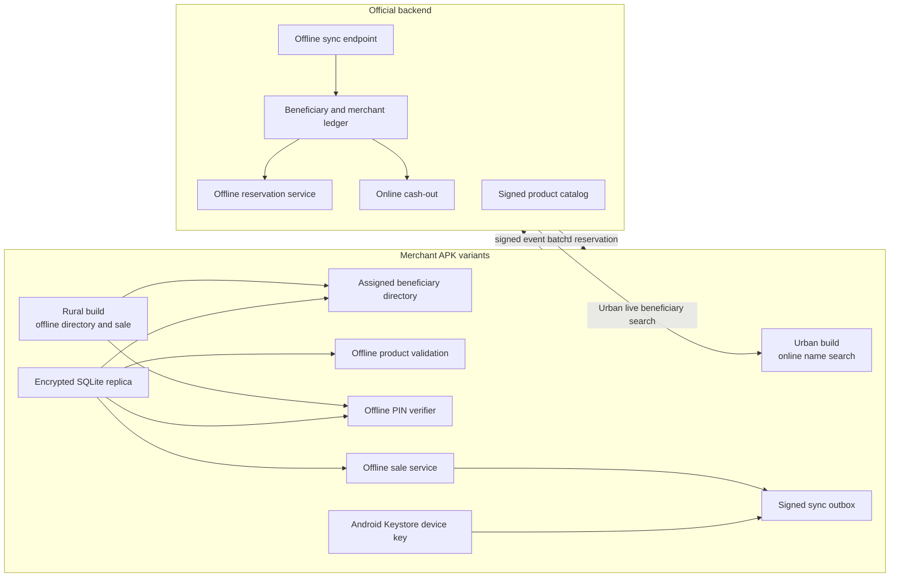
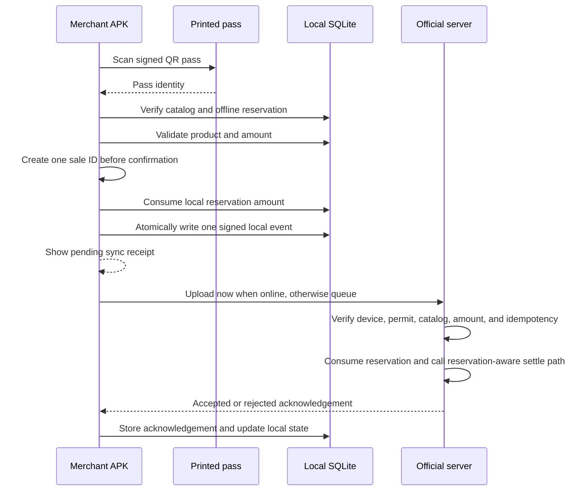

# Design: Offline product validation and transactions

Date: 2026-08-04

Last updated: 2026-08-05

Status: Owner-approved design finalized; implementation and verification pending.

## 1. Decision

BANTAYOG will support a quota-limited offline merchant sale flow with a bounded security model.

There will be two merchant APK variants:

- **Urban (Standard)** — the existing merchant workflow. A no-card payment uses an online
  beneficiary name search, followed by server-side PIN verification.
- **Rural (Exclusive)** — all Urban features plus an assigned local beneficiary directory,
  offline product validation, offline PIN validation, offline permits, and synchronization.

The merchant phone will validate products and record a sale without a network. The phone will
not hold the full official beneficiary balance as an independent source of money. The server will
issue a small, signed offline credit reservation for a merchant device. The phone can spend only
from this reservation.

"Offline at the point of sale" means that no network is needed at the time of product scan, QR
scan, product validation, beneficiary selection, PIN validation, or sale recording. The Rural
merchant must still receive the catalog, assigned beneficiary records, offline PIN verifier, and
signed permits before the phone loses its network. If there is no active permit, the phone must
not record a credit sale.

The phone will mark the sale as `PENDING_SYNC`. The official backend will create the official
transaction only after it verifies the signed event and consumes the reservation. The merchant can
cash out only from the server-side available balance after synchronization.

The QR pass will identify the beneficiary. It will not carry the current balance. The current QR
flow uses HS256. Offline verification must migrate the pass to an asymmetric signature. The
private signing key stays on the server. The public verification key may be bundled in the APK.

This design does not copy a beneficiary balance to every merchant. It stores only the data that
the Rural merchant needs for an active reservation and an offline sale. The local permit amount is
a spending limit, not a local balance.

The server may issue active permits to up to seven distinct Rural merchants for one
beneficiary. The eighth distinct Rural merchant must be rejected. The server counts merchant IDs,
not devices, so multiple devices for one merchant share one aggregate merchant allocation.

An administrator must approve each beneficiary-to-merchant assignment before the merchant can
search, provision, or reserve for that beneficiary. A merchant cannot create an assignment by
knowing a name, PIN, pass, or beneficiary identifier.

Branded product identification is barcode-first in both APKs. An exact barcode catalog hit does
not need Gemini. When the phone is online, Gemini remains the fallback identifier. The catalog is
always the eligibility authority. Rural permit-backed checkout uses one local-first signed event
path whether the network is available or not. This rule prevents an uncertain network response
from creating a second sale.

## 2. Goals

1. Let a Rural merchant validate an eligible product with no network.
2. Let a Rural merchant record a permitted sale with no network.
3. Let up to seven Rural merchants serve the same beneficiary offline without copying the same
   balance.
4. Keep the official database as the source of truth for money and audit records.
5. Let the merchant phone recover after a crash, app restart, or temporary network loss.
6. Let the merchant sync records after the phone reconnects.
7. Keep the flow usable on low-end Android phones.
8. Keep cash-out online only.
9. Keep eligibility catalog-backed and deterministic.
10. Keep Urban online name search separate from Rural local beneficiary search.
11. Keep barcode scanning available in Urban and Rural while online and in Rural while offline.
12. Make online-to-offline fallback idempotent and fail closed on security or policy failures.
13. Restrict Rural provisioning to administrator-approved merchant-beneficiary assignments.
14. Define safe QR, catalog, key rotation, conflict review, retention, and device replacement.

## 3. Non-goals

- No unrestricted offline spending from a QR pass.
- No full beneficiary database on the merchant phone.
- No official beneficiary balance replica on the merchant phone.
- No canonical beneficiary PIN hash on the merchant phone. Rural may use a separate, device-bound
  offline verifier package under the controls in section 7.2.
- No local cash-out or local wallet transfer.
- No overwrite of official database rows with a local database snapshot.
- No business decision in `apps/web`.
- No mainnet deployment or real-money integration.
- No GCash, GoTyme, or bank-account payout integration in this release. These are future partnership
  plans only and need a separate approved design and security review.

## 4. Terms

### Urban build

The standard merchant APK. It uses the live backend for beneficiary name search and PIN
verification. It does not contain the Rural offline directory or sale queue.

### Rural build

The merchant APK variant that includes the offline product, beneficiary, permit, and
synchronization features in this document.

### Official backend

The Hono API, Supabase Postgres database, product catalog, transaction ledger, and cash-out path.
It is the authority for money.

### Merchant edge

The merchant APK and its encrypted local SQLite database. It is the authority for the local user
interface while the phone is offline. It is not the authority for final money settlement.

### Offline reservation

A server record that limits how much one beneficiary may spend through one merchant device for at
most 30 calendar days. It is bound to a beneficiary, merchant, device, policy version, catalog
version, server issue time, and expiry time.
All active reservations for one beneficiary are counted before the server issues a new reservation.
The server also counts distinct Rural merchant IDs. It may issue permits to at most seven distinct
Rural merchants for one beneficiary. Multiple devices for one merchant do not create additional
merchant slots. The sum of all device reservations for one beneficiary and merchant must stay
within the server policy cap for that beneficiary and merchant. This prevents a merchant from
multiplying its allowance when it registers another phone.

### Offline permit

The signed offline representation of an offline reservation. The phone verifies the permit
without a network. The server remains the authority for the reservation record and its remaining
amount. One reservation may support several local sales until its amount is consumed or it
expires.

### Offline event

An append-only, device-signed description of a local sale. It is not an official transaction until
the server accepts it.

### Offline PIN verifier

A separate, device-bound verifier package used only by the Rural APK. It is provisioned after an
online PIN verification. It is not the canonical server `pin_hash_argon2id` value and is not
accepted by any online authentication endpoint.

### Beneficiary merchant assignment

An administrator-approved relationship between one beneficiary and one Rural merchant. It has a
server policy cap, validity period, status, approval actor, and audit timestamps. It is required
before directory provisioning or reservation issuance. At most seven distinct Rural merchants can
have active assignments for one beneficiary.

### Offline merchant certificate

A server-signed, device-bound certificate that authorizes a merchant to use only local Rural
actions during an offline period. It expires no later than the permit. It cannot authorize sync,
provisioning, reservation release, cash-out, or an administrator action.

### Catalog release

An immutable, canonical, administrator-created product and commodity policy payload. It includes a
digest, version, policy version, validity period, key ID, algorithm, and server signature. A permit
pins one catalog and policy release.

### Sale ID

A UUID that the Rural APK creates before final confirmation. The same sale ID identifies the local
event, immediate online upload, retries, late responses, and official transaction idempotency.

## 5. System architecture



The architecture follows the Android offline-first pattern: the local database provides fast
offline reads, and a network repository synchronizes the local data when the network returns. See
[Android offline-first guidance](https://developer.android.com/topic/architecture/data-layer/offline-first?hl=en).

The shared Android source set contains the Branded barcode scanner, so both APKs can scan barcodes.
The Rural source set contains the encrypted local database, OCR adapter, catalog installer, permit
store, merchant certificate, event signer, and sync worker. The server validates the registered
device variant. A local build flag cannot grant Rural authority.

The Rural checkout uses one local-first event pipeline. It writes one event before the first upload
attempt. Online and offline states change only when that event is uploaded or acknowledged. Urban
checkout stays on the current direct online transaction path.

## 6. Online provisioning

The merchant must connect at least once before the phone can perform an offline sale.

### 6.0 Assignment approval

An administrator creates an active beneficiary merchant assignment. The backend enforces a maximum
of seven active distinct Rural merchant IDs for one beneficiary. Multiple devices for one merchant
use the same assignment. Search, provisioning, PIN verifier creation, and reservation issuance must
reject an absent, expired, revoked, or wrong-merchant assignment. Demo data can seed assignments.

### 6.1 Device registration

On first approved use, the APK creates a device key pair. The private key stays in Android
Keystore. The server stores the public key and device status.

The server may use key attestation for stronger device registration. The app must still work on
devices without StrongBox. The server then applies a lower offline limit. See the [Android
Keystore documentation](https://developer.android.com/privacy-and-security/keystore) and [key
attestation guidance](https://developer.android.com/privacy-and-security/security-key-attestation).

### 6.2 Product catalog

An authenticated administrator creates a catalog release. Before signing, the backend rejects a
duplicate barcode, ambiguous alias, invalid category, missing eligibility value, invalid commodity
unit, reversed or missing price range, invalid validity period, and a reused release version. The
backend stores the immutable canonical payload and its digest. It uses a catalog signing key that
is separate from the QR and permit keys.

The server sends the signed catalog release. The catalog includes:

```text
catalogVersion
policyVersion
productId
barcode values
canonical name
local aliases
category
eligibility status
valid from and valid until
key ID and algorithm
catalog signature
```

The phone installs the complete release in one local transaction. It keeps the last-known-good
release if verification or installation fails. A key update must chain to a bundled trust root or
an already trusted signing key. The phone rejects an expired or invalid release.
Unknown products remain `UNKNOWN`. An unknown category may serialize as `OTHER`, but `OTHER` does
not mean eligible.

### 6.3 Offline credit reservation

The merchant requests a reservation while online. A server-side database function locks the
beneficiary and checks available credits against existing active reservations. It then creates a
reservation bound to:

```text
reservationId
beneficiaryId
merchantId
deviceId
maximumCredits
remainingCredits
issuedAt
expiresAt
policyVersion
catalogVersion
nonce
serverSignature
```

The server signs these fields as the offline permit. The phone stores the permit with the local
reservation. The permit cannot be changed by the merchant. The permit amount is a limit, not a
new beneficiary balance.

The issuance function must first verify the active beneficiary merchant assignment. The merchant
cannot request an arbitrary quota. The server policy and assignment cap choose the amount.

The server must apply this invariant while it holds the beneficiary row lock:

```text
available_for_new_spend =
  credit_balance - sum(active offline reservation remaining amounts)
```

The server must also enforce:

```text
active distinct Rural merchant IDs with remaining reservation > 0 <= 7
```

For multiple devices of one merchant, the server must enforce:

```text
sum(active remaining amounts for this beneficiary and merchant)
  + new device reservation amount
  <= server policy cap for this beneficiary and merchant
```

The sum of active reservations for all Rural merchants must never exceed the beneficiary's
unreserved credit. For example, if the official balance is 1,000 credits, the server may issue a
300-credit permit to Store A and a 200-credit permit to Store B. Store A and Store B can then serve
the beneficiary while offline, but neither store can spend outside its own permit. The same rule
supports up to seven distinct Rural merchants. An eighth distinct merchant cannot receive a new
active permit. A policy may use fewer than seven merchants.

An online sale must spend only the unreserved amount. An accepted offline event must reduce the
reservation and beneficiary credit in one database transaction. An unused reservation becomes
available after expiry or explicit release.

The reservation limit must be small enough to limit loss if a device is stolen. The limit and
expiry are policy settings. They are not request values that the merchant can choose.

An unused reservation becomes available after expiry. Expiry or release does not add an amount to
`beneficiaries.credit_balance`. It changes the reservation state so that its remaining amount is
not part of the active reservation sum. A lost device does not create an unlimited claim on the
beneficiary account.

The owning merchant or an administrator can release an unused reservation while online. The
release operation requires a fresh authenticated session and an audit reason. It sets the
reservation to an inactive state. It never adds an amount to `credit_balance`. Automatic expiry
continues to release the amount from the active reservation sum.

### 6.4 Permit time and trusted time

The server sets `issuedAt` and `expiresAt`. The maximum lifetime is 30 calendar days. The phone
stops new offline sales 24 hours before `expiresAt`. The server accepts a new event only when the
server receives it before `expiresAt`. The device `createdAt` is audit information only. It cannot
extend a permit because a merchant can change the phone clock.

The signed catalog and the offline PIN verifier must remain valid through the permit sale window.
If either one expires sooner, the server must shorten the permit to the earliest expiry.

The phone shows warnings seven days and 72 hours before expiry. It stops new sales 24 hours before
expiry. It stores a trusted server time and elapsed-time reference. Its effective time never moves
backward. A clock rollback cannot extend a permit. A large forward jump fails closed until the phone
gets a new trusted server time. The server receipt time is the final expiry authority.

### 6.5 Offline merchant certificate

After fresh online merchant authentication, the backend may issue an `OfflineMerchantCertificate`
for the registered Rural device. It contains the merchant ID, device ID, app variant, allowed local
capabilities, issue time, expiry, certificate version, key ID, and signature. Its expiry cannot be
later than the earliest permit expiry.

The phone requires a native merchant unlock before it uses the certificate. This unlock is separate
from the beneficiary PIN, is protected by Android Keystore, and has failed-attempt controls. The
certificate authorizes local search, validation, PIN checks, and event creation only. A fresh online
merchant session remains required for sync, provisioning, release, cash-out, and administration.

## 7. QR pass and guardian authorization

### 7.1 QR pass

QR pass version 2 must use ES256 with a P-256 key. The deployed verifier must have no HMAC fallback.
The APK must never contain a QR signing private key or a secret that can mint a pass. Because the
project has no production users, implementation can regenerate all demo passes.

The payload contains only issuer, audience, pass ID, opaque beneficiary reference, pass version,
key ID, issue time, expiry, and revocation version. It must not contain a beneficiary name,
guardian name, wallet reference, balance, PIN hash, PIN reference, or other private data.

Every route that accepts a pass, including authentication, transactions, balance, provisioning,
and synchronization, checks the cryptographic signature, issuer, audience, expiry, database pass
record, and revocation state. QR, permit, and catalog signatures use separate key pairs. Every
signed object carries its algorithm, key ID, and format version. Rotation keeps old and new public
keys available for an overlap period. A device accepts a key update only from a bundled trust root
or another already trusted signature.

### 7.2 PIN decision

#### Urban no-card payment

Urban searches the live backend by beneficiary name when the card is not available. The backend
returns a masked result and a stable beneficiary identifier. After the merchant selects the
beneficiary, the backend verifies the six-digit PIN against the canonical Argon2id verifier. The
Urban APK does not store a beneficiary PIN or a copy of the canonical verifier.

#### Rural offline payment

Rural searches its assigned local beneficiary directory. After the merchant selects a result, the
Rural APK verifies the PIN against a separate device-bound offline verifier package.

The server provisions this package only after online PIN verification and Rural device
registration. The package must:

- not contain the server's canonical `pin_hash_argon2id` value;
- be encrypted at rest with a key protected by Android Keystore;
- be scoped to the beneficiary, Rural device, app variant, and verifier version;
- lock offline no-card payment after five failed attempts until the phone completes an online
  re-provision;
- expire or require re-provisioning under server policy; and
- never be accepted by an online authentication endpoint.

For the first release, the guardian enters the PIN during an online Rural provisioning or
refresh step. The server verifies the PIN over the authenticated connection, creates the separate
device-bound package, and does not store the raw PIN. If the package is not already installed,
Rural no-card offline payment is unavailable for that beneficiary.

The exact KDF or native verifier implementation requires a separate security and low-end-device
benchmark gate before code is written. The verifier policy is signed and must contain all of these
limits:

- maximum amount per no-card sale;
- maximum total no-card amount for the verifier;
- maximum successful no-card event count; and
- five failed attempts before an online-only unlock.

The Rural APK must fail closed if a limit is absent. No-card limits must be lower than with-card
limits. Each signed sale event records the authorization method, verifier version, failed-attempt
count, and successful-use ordinal. The server enforces the amount and accepted-event limits again
during synchronization.

For the first controlled pilot, the maximum no-card amount is 200 credits per sale, 500 credits in
total per verifier, and three successful no-card events. A permit can lower these values. Raising a
value needs a later ADR and security review.

A six-digit offline PIN has weaker protection on a rooted or fully compromised phone than a live
server check. A compromised merchant app can bypass its own PIN screen and use its registered
device key. Therefore, the offline PIN is a local deterrent. It is not cryptographic proof to the
server that the guardian entered the PIN. Encryption, a memory-hard verifier, the permanent local
lock, small no-card limits, signed events, and synchronization audits limit the exposure.

The signed permit remains required after PIN verification. A PIN does not authorize an amount by
itself. The permit is bound to the beneficiary, merchant, device, amount, and expiry. A merchant
cannot create a permit.

A future stronger design may use a beneficiary-held NFC smart card that signs a transaction
challenge. That is outside this design.

## 8. Hybrid product identification and catalog validation

The Branded scanner uses these paths:

```text
Urban online  : shared barcode scan -> server catalog -> Gemini fallback -> server catalog
Rural online  : shared barcode scan -> signed local catalog -> Gemini fallback -> signed catalog
Rural offline : barcode -> signed local catalog -> OCR alias -> UNKNOWN and block
Urban offline : no transaction support
```

An exact barcode catalog hit does not call Gemini. Gemini stays available while online when the
barcode is missing, unreadable, or not in the catalog. Gemini, barcode, and OCR identify products.
They do not decide eligibility. The catalog result is final.

For Rural offline validation, the order is:

1. Capture one frame and check image quality.
2. Scan a barcode.
3. Look up the barcode in the permit-pinned signed catalog.
4. If no barcode matches, run bundled Latin OCR.
5. Match the OCR result against unambiguous approved aliases.
6. Apply the signed catalog eligibility status.
7. If no exact approved match exists, return `UNKNOWN` and block the sale.

The audit method is one of `ONLINE_BARCODE`, `ONLINE_GEMINI`, `OFFLINE_BARCODE`, `OFFLINE_OCR`,
or `OFFLINE_MANUAL_COMMODITY`.

The current online `VisionService` and `PricingValidationService` behavior must change before this
design is enabled. A Gemini `is_child_friendly` verdict cannot authorize a product. An unmatched
result cannot become an approved product. An unknown category cannot default to `VEGETABLES`; it
maps to `OTHER` or `UNKNOWN` and blocks checkout. For a non-branded item, the signed commodity
policy decides eligibility, units, and price bounds. Gemini may compare identity or evidence only.

Online product lookup falls back to the deterministic Rural validator only for network, DNS,
timeout, HTTP 408, HTTP 429, or HTTP 5xx failures. It does not fall back after a valid ineligible
result, HTTP 400 invalid-image result, HTTP 401 or 403 result, or invalid signature or configuration.
`navigator.onLine` is a hint only. The request result and timeout decide the branch.

OpenCV is limited to image quality and crop operations. ML Kit barcode and text models are
bundled in the APK. A small quantized image model may be added later as an identification aid.
YOLO and a small language model are not required for the first release.

### 8.1 Non-branded commodities

Many non-branded goods, such as eggs, vegetables, and fish, have no barcode or printed label. The
signed release must include a deterministic commodity list with these fields:

```text
commodityId
canonicalName
localAliases
category
eligibility
allowedUnits
minimumPriceCentavos
maximumPriceCentavos
validFrom
validUntil
```

The merchant manually selects the commodity, unit, quantity, and price. OCR or an image model can
suggest a commodity, but the merchant must select an entry from the signed list. The model cannot
authorize the item. An unknown commodity, unit, or out-of-policy price blocks an offline sale. The
event stores the commodity ID, unit, quantity, price in centavos, catalog version, policy version,
and an optional image digest. It does not need the full image.

The product result must include evidence fields:

```text
productId
eligibility
matchMethod
catalogVersion
policyVersion
modelVersion, when used
imageDigest, when an image was captured
```

Do not store the full product image in the offline transaction unless a separate privacy decision
approves it.

The system cannot prove physical weight, freshness, delivery, or merchant truth from one image.
It limits this residual risk with signed commodity IDs, allowed units, integer-centavo price
bounds, per-sale and permit caps, an optional image digest, and random audit selection. AI cannot
replace a physical inspection or prove that the beneficiary received the goods.

## 9. Rural permit-backed sale flow



The payment identity branch is:

```text
Urban + Bantayog Card       -> live or signed QR identity -> server PIN verification
Urban + no card             -> online beneficiary name search -> server PIN verification
Rural + Bantayog Card       -> signed QR identity -> local PIN/permit checks when offline
Rural + no card              -> local beneficiary name search -> local PIN/permit checks when offline
```

For Rural, local name search identifies a beneficiary record. It does not provide a balance. The
permit provides the bounded spending amount.

The Rural APK uses this same local-first event path when it has a network. It creates one sale ID
before final confirmation, writes one signed event, then attempts immediate synchronization. A
network, DNS, timeout, HTTP 408, HTTP 429, or HTTP 5xx failure leaves the same event pending. A
retry or late response uses the same sale ID and event ID. The Rural APK must not call the direct
Urban transaction path for a permit-backed sale.

Automatic fallback is allowed only when the active assignment, permit-pinned catalog, offline
merchant certificate, permit, and required beneficiary verifier are installed and valid. If one
item is missing, the app shows `Offline unavailable` and does not record a credit sale.

The local database must commit the reservation consumption and event insert in one local
transaction. A crash must not spend the local reservation twice.

For an accepted event, the official server must use one database transaction to claim the event
ID, verify the current database state, consume the reservation, deduct the beneficiary amount,
credit the merchant, insert the official transaction, store the final event decision, and insert
the synchronization receipt. A failure rolls back all writes. A rejected or conflicting event
must store its event row and receipt together without moving money. The existing `settle_sale`
path must be extended in a reservation-aware way, or a database helper called by it must perform
the same atomic work. Do not reimplement the balance lock in TypeScript.

## 10. Synchronization

The phone sends events. It does not send a full database snapshot.

The sync endpoint accepts a batch with an idempotency key for every event. The response gives one
result per event:

```text
eventId
accepted | rejected | conflict
officialTransactionId, when accepted
reason, when rejected or conflicting
serverCursor
```

The sync process must:

1. Send events in local sequence order.
2. Retry network failures with exponential backoff.
3. Stop retrying validation, authentication, and signature failures.
4. Keep rejected events for audit.
5. Never silently delete an event.
6. Pull catalog, reservation, device, and revocation updates after upload.
7. Use high-priority work when a permit or event is near its final receipt deadline.
8. Require a fresh online merchant session. The offline merchant certificate cannot authorize sync.

Synchronization is not the mechanism that prevents cross-merchant over-spend. The central
reservation check prevents over-issuance before the devices go offline. Synchronization confirms
or rejects each event after the sale.

Android WorkManager is the preferred native queue runner because it supports persistent work and
network constraints. See the [WorkManager API reference](https://developer.android.com/reference/androidx/work/WorkManager.html).

## 11. Conflict handling

The server must reject or quarantine an event when:

- the event signature is invalid;
- the device is revoked;
- the server receives the event at or after the reservation expiry;
- the reservation belongs to another merchant or device;
- the reservation has already been consumed;
- the event amount is greater than the reservation amount;
- the pass is invalid or revoked in the latest server state;
- an item is not eligible under the permit-pinned catalog version;
- the event is a duplicate with different content;
- the transaction identifier was already used for another event.

The merchant UI must show `Needs review` for a conflict. It must not show the money as available.
An administrator must be able to inspect the event, reservation, and server decision.

The admin conflict queue shows the immutable signed event, reservation, assignment, product
evidence, and server decision. Review actions are append-only. An administrator cannot edit the
original event, edit a balance, or change the original conflict to accepted.

The safe demo action is `CLOSE_REJECTED`. A later optional remediation is a new online transaction
that passes current merchant, beneficiary, guardian PIN, product eligibility, amount, balance, and
authorization checks. It links to the original conflict, but the original event stays in conflict.
Invalid signatures, a replay with changed content, wrong merchant or device, over-limit amount,
and an ineligible product are terminal rejections.

### 11.1 Policy, catalog, and revocation timing

Use the versions that are signed into the permit for normal nutrition and price decisions. A
routine catalog or policy update does not change a sale retroactively. For example, if a store
downloads an approved list on Monday and sells offline on Tuesday, a routine Wednesday update does
not invalidate the Tuesday permit.

Use the current server state only for an emergency revocation of a merchant, device, beneficiary,
pass, reservation, or product. Because the phone could not know about the emergency while offline,
the server returns `conflict` and `Needs review`. It does not make the amount cash-outable. The
server must not trust the phone timestamp to decide that an event happened before the revocation.

## 12. Merchant balance and cash-out

An offline sale increases only the local `pendingEarnings` value. It does not create a cash-out
claim.

After the server accepts the event:

1. The official transaction is recorded.
2. The official merchant balance increases.
3. The merchant phone receives the acknowledgement.
4. The local pending amount becomes accepted.
5. Cash-out becomes available through the online server path.

The existing online testnet EVM wallet cash-out path is separate from this offline design, if it is
retained by the current application. A local database must never initiate or confirm a payout.
GCash, GoTyme, and bank-account transfers are not current implementation scope.

### 12.1 Future real-money payout plan — not implemented

GCash, GoTyme, and bank-account payouts are future work only. They require a formal partnership,
approved provider APIs, compliance and identity rules, merchant consent, fraud controls, security
review, reconciliation, refund handling, and operational failure handling.

The current plan must not add provider credentials, provider API calls, real-money transfer code,
or payout UI for these providers. A later ADR must approve that work. Until then, only the existing
online testnet EVM wallet path may be used, and only server-accepted merchant earnings may be
cashed out.

## 13. Local data and privacy

Store only the minimum data required by the merchant flow:

- pass identifier and beneficiary identifier;
- masked beneficiary search fields for the assigned Rural directory;
- active reservation data;
- Rural offline PIN verifier package, when provisioned;
- product catalog data;
- transaction item data;
- sync status and acknowledgements;
- device and key metadata.

Do not store the canonical beneficiary PIN hash, plaintext PINs, private keys, full household
profiles, or unnecessary images. Encrypt the local database. Treat a rooted or compromised phone
as able to change local display data. The server must trust only server signatures, device
signatures, reservations, and its own database checks.

Remove an assigned beneficiary record and its offline PIN verifier after assignment, permit, or
device revocation or expiry. Keep pending and `Needs review` events until the server returns a
receipt or an administrator records a resolution. Remove detailed accepted and rejected data 30
calendar days after the server receipt or conflict
resolution. Keep only the minimum receipt for 90 calendar days after that server action. A
server-signed policy can shorten these pilot defaults. Raising them needs a privacy review. Store no
full product image; an optional digest is sufficient.

Device replacement is online. Revoke the old device, release or expire its unused reservations,
and register the new device. Never copy the old private key. If a phone is destroyed before an
event reaches the server, the event is not recoverable. Immediate sync, warnings, small caps, and
operational review reduce this risk but cannot remove it.

## 14. Low-end phone constraints

- Run product validation on one captured image, not every camera frame.
- Prefer barcode scanning before OCR or image inference.
- Bundle the Latin OCR model. Do not download a model at first use.
- Use small image dimensions and release bitmap memory after each scan.
- Run one model at a time.
- Do not use YOLO or an sLM in the first release.
- Add a timeout and a manual retry path.
- Keep the catalog compact and update it by version or delta.
- Do not depend on a model download during first launch.
- Test on a representative low-end device with low memory, slow storage, and a 720p camera.
- Benchmark the exact Urban and Rural APK artifacts on that physical device.
- Test cold start, airplane mode, app kill, restart, low battery, full storage, clock drift, and
  intermittent network.

### 14.1 Demo cost controls

The demo can use the current free tiers, Gemini free quota, local open-source components, and
Polygon Amoy testnet without a new mandatory provider fee. Configure Gemini usage limits and
alerts. Do not enable a paid automatic upgrade. When Gemini quota or service is not available, use
the permitted deterministic Rural fallback. Before the demo, verify that the selected image-capable
model still has a free tier. Send a product-only crop with no beneficiary, guardian, merchant, PIN,
pass, or transaction data. Google's current pricing notice says that free-tier content can be used
to improve its products. Real-user use therefore needs a separate privacy and provider review. Do
not call a real payout provider. Production scale will have hosting, support, security, monitoring,
and partner costs, but those costs are outside the demo implementation.

## 15. Required backend shape

The implementation will need new additive schema objects. Names are logical and must be reviewed
against the live migrations before implementation:

```text
merchant_devices
beneficiary_merchant_assignments
offline_merchant_certificates
offline_credit_reservations
offline_transaction_events
offline_sync_receipts
offline_catalog_releases
offline_conflict_reviews
```

The reservation table must support multiple active reservations for one beneficiary. The database
must enforce the global amount rule and the maximum of seven distinct active Rural merchant IDs
through a row lock and a transaction, not through a TypeScript balance calculation. Multiple
devices for one merchant count as one merchant. The same locked operation must enforce the
aggregate per-merchant cap across all of that merchant's devices. A reservation is closed or
reduced when it expires, is released, or is accepted during synchronization. Expiry and release do
not increment `credit_balance`.

It will also need server operations for:

```text
register_merchant_device
approve_beneficiary_merchant_assignment
issue_offline_merchant_certificate
issue_offline_reservation
release_offline_reservation
release_expired_reservations
create_offline_catalog_release
sync_offline_events
close_offline_conflict
```

The final settlement must use a reservation-aware Postgres path with row locks and idempotency. It
must store the accepted event decision and receipt in the same transaction that moves money.
The current `transactions.status` values remain unchanged. Local sync states must not be added to
the database status CHECK without a separate decision.

The Urban no-card search must be a merchant-authorized online operation. The Rural provisioning
operation must return only the assigned local directory, active permits, signed catalog release,
offline merchant certificate, and the Rural device's verifier package. It must not return a full
beneficiary balance list. Every search, provision, verifier, and reservation operation must check
the active assignment.

The event table needs a unique sale ID, assignment ID, product identification method, canonical
payload digest, local sequence, and immutable decision. Conflict reviews use a separate append-only
table. The original event is never changed to accepted. A remediation transaction, if enabled,
uses a new transaction ID and links back to the conflict.

Every migration must be append-only and mirrored in `packages/db/src/types.ts` and its tests.
Changes to `settle_sale`, authentication, QR signing, or RLS require explicit approval before
implementation.

### 15.1 Money representation

Signed payment payloads, TypeScript, Kotlin, and SQLite use whole integer credits. API fields use
names such as `amountCredits`, and JSON carries them as decimal strings when JavaScript safe-integer
limits are relevant. Kotlin uses `Long`, and TypeScript converts the decimal string to `bigint`.

Postgres stores money as `NUMERIC(12,2)` and requires offline credit amounts to have `.00`. One
credit is one PHPC and `10^18` PHPC wei. Item unit prices and price ranges use integer centavos.
No component uses a floating-point value for money.

## 16. Testing and acceptance

### Unit tests

- reservation amount boundaries;
- reservation expiry;
- server receipt-time expiry and rejection of device-clock backdating;
- product catalog version checks;
- barcode and OCR match rules;
- shared barcode behavior in both APK variants;
- Gemini online fallback and catalog-controlled eligibility;
- fallback on network, DNS, timeout, 408, 429, and 5xx only;
- no fallback after ineligible, invalid-image, authentication, or signature/configuration results;
- deterministic non-branded commodity selection, unit, quantity, and price-range checks;
- unknown product rejection;
- event canonicalization and signatures;
- event idempotency;
- local reservation consumption;
- conflict classification.
- trusted-time rollback and forward-jump handling;
- atomic catalog installation and last-known-good recovery;

### Server tests

- concurrent reservations across up to seven distinct merchants cannot exceed available credits;
- an unassigned merchant cannot search, provision, create a verifier, or reserve credits;
- the seventh distinct merchant can receive a policy-approved permit, the eighth distinct
  merchant is rejected, and a second device for an existing merchant does not consume another
  merchant slot;
- two events cannot consume one reservation twice;
- an online sale cannot spend reserved credits;
- a duplicate event returns the original acknowledgement;
- invalid device signatures are rejected;
- revoked devices are rejected;
- expired reservations are released;
- authenticated manual release records an actor and reason and never adds credit;
- reservation release does not increment the beneficiary balance;
- all active device reservations for one merchant stay within one aggregate merchant cap;
- an accepted event creates one official transaction and one merchant balance credit;
- accepted settlement, final event decision, and synchronization receipt commit atomically;
- normal policy updates use the permit-pinned version and emergency revocations create a conflict;
- rejected events do not change money.
- QR version 2 checks signature, audience, expiry, and revocation on every pass route;
- QR, permit, and catalog keys rotate independently with an overlap period;
- catalog release creation rejects invalid and ambiguous data and produces an immutable payload;
- conflict review is append-only and remediation cannot change the original decision;

### Device tests

- product validation works in airplane mode;
- an exact barcode works in both Urban and Rural while online and in Rural while offline;
- Gemini is used online only when barcode identification does not finish the match;
- a permitted sale works in airplane mode;
- a phone restart preserves the local event;
- a repeated sync does not duplicate the sale;
- a network drop during upload retries safely;
- one sale ID survives timeout, late response, retry, and app restart without duplication;
- a rejected event does not become cash-out balance;
- cash-out is disabled until the server acknowledgement is present.
- up to seven Rural merchants with separate permits cannot settle more than the combined reserved
  amount;
- an eighth Rural merchant cannot receive a new permit for the beneficiary;
- an online purchase cannot consume credits already reserved for any Rural merchant.
- expired or revoked assignments remove the directory record and PIN verifier but preserve pending
  audit events;
- the exact APKs meet the agreed scan and checkout limits on a representative low-end 720p phone.

Physical acceptance requires a real transaction ID and stored server audit evidence after sync. A
passing unit test or APK build is not proof of a completed offline-to-online sale.

## 17. Reference guides

These sources guide the design. BANTAYOG is not a CBDC system, but the BIS Project Polaris work is
useful for offline limits, device security, expiry, synchronization, inclusion, and operational
risk.

- [BIS Project Polaris: high-level design guide for offline payments](https://www.bis.org/publ/othp79.htm)
- [BIS Project Polaris: handbook for offline payments with CBDC](https://www.bis.org/publ/othp64.htm)
- [Android offline-first application guidance](https://developer.android.com/topic/architecture/data-layer/offline-first)
- [Android Keystore system](https://developer.android.com/privacy-and-security/keystore)
- [Android WorkManager](https://developer.android.com/reference/androidx/work/WorkManager)
- [ML Kit barcode scanning for Android](https://developers.google.com/ml-kit/vision/barcode-scanning/android)
- [ML Kit text recognition for Android](https://developers.google.com/ml-kit/vision/text-recognition/v2/android)
- [SQLCipher Community Edition license](https://www.zetetic.net/sqlcipher/license/)
- [OpenCV license](https://opencv.org/license/)
- [Gemini Developer API pricing and free-tier data terms](https://ai.google.dev/gemini-api/docs/pricing)

## 18. Implementation boundary

This finalized document is a design only. The matching implementation plan gives the execution
order. It does not authorize a real database migration, deployment, contract change, provider
integration, commit, or push. The executor must stop at every approval gate for `settle_sale`, QR
signing, authentication, RLS, native dependencies, and real environments. GCash, GoTyme, and bank
account payout providers remain future plans only.
